# Agile Project Management

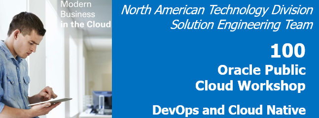

Updated: April 17, 2018

## Introduction

This is the first of several labs that are part of the **Oracle Public Cloud DevOps and Cloud Native Microservices workshop.** This workshop will walk you through the Software Development Lifecycle (SDLC) for a Cloud Native project that will create and use several Microservices.

Although you will login as a single user, you will take on 4 Personae during the workshop. The **Project Manager** Persona will create the projects, add tasks and features to be worked on, and assign tasks to developers.  The Project Manager will then start the initial sprint. The **Java Developer** persona will develop a new twitter feed service that will allow for retrieval and filtering of twitter data. The **Full Stack Developer** persona will develop a new database microservice that allows access to the product catalog data. The **JavaScript Developer** persona will make enhancements to the Product Catalog UI that will display the twitter data related to a select catalog item.  During this workshop, you will get exposure to Oracle Developer Cloud Service and Oracle Application Container Cloud Service.

***To log issues***, click here to go to the [github oracle](https://github.com/oracle/learning-library/issues/new) repository issue submission form.

## Objectives

- Create the Developer Cloud Service Instance
- Create the Developer Cloud Service Builder Template/Image
- Create Initial Project
- Create Product Issues
    - Create Issues for Twitter Feed Microservice
    - Create Issues for Database Microservice
    - Create Issues for Product Catalog UI enhancements
- Create Agile Board and initial Sprint
- Add Issues to Sprint
- Start Sprint
- Configure Build Server Infrastructure

## Required Artifacts

- The following lab requires an Oracle Public Cloud account that will be supplied by your instructor.

# Create Alpha Office Product Catalog Project

## Create Developer Cloud Service Instance

### **STEP 1**: Login to your Oracle Cloud Account/Create DevCS Instance

- If you are not already signed into the Oracle Cloud Dashboard, then from any browser go to the URL below:

    `https://cloud.oracle.com`

- click **Sign In** in the upper right hand corner of the browser

    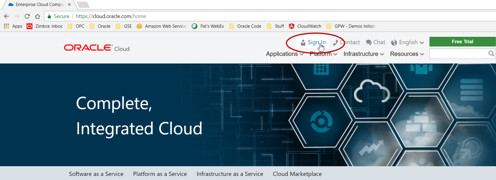

- Select **Cloud Account with Identity Cloud Service** from the drop down, enter your **Cloud Account Name** recorded in your welcome email and described in the **Trial Account Setup Guide**. Click on the **My Services** button.

    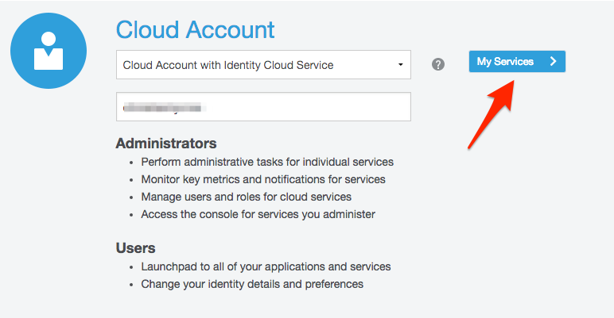

  **NOTE:** For this lab you will assume the role of Project Manager ***Lisa Jones***. Although you are assuming the identity of Lisa Jones, you will log into the account using the **username** provided to you by your instructor, given to you by your corporation, or supplied to you as part of an Oracle Trial. As you progress through the workshop, you will remain logged in as a single user, but you will make “logical User" changes from Lisa Jones the Project Manager to other personas.

    

- Since you Customized your Dashboard as part of the **Trial Account Setup Guide**, your dashboard should display the following services:

    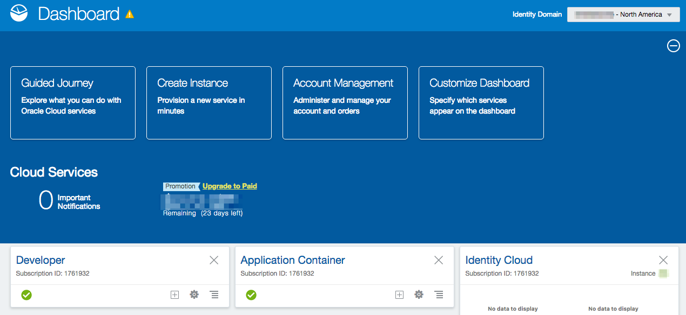

### **STEP 2**: Configure the Developer Cloud Service

Oracle Developer Cloud Service provides a complete development platform that streamlines team development processes and automates software delivery. The integrated platform includes an issue tracking system, agile development dashboards, code versioning and review platform, continuous integration and delivery automation, as well as team collaboration features such as wikis and live activity stream. With a rich web based dashboard and integration with popular development tools, Oracle Developer Cloud Service helps deliver better applications faster.

- From the Cloud UI dashboard, **Right Click** on the **Developer** service, then open the Service in a new tab. This will keep the Dashboard and the Developer consoles loaded at the same time.

    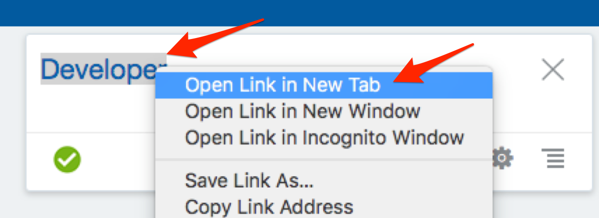

- The first time you attempt to load the Developer Cloud Service, the following will be displayed. Click on the **Go to Console** button.

    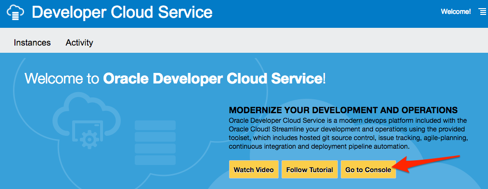

- You will now need to create an **Instance** on which the Developer Cloud Service will run. Click on the **Create Instance** button.

    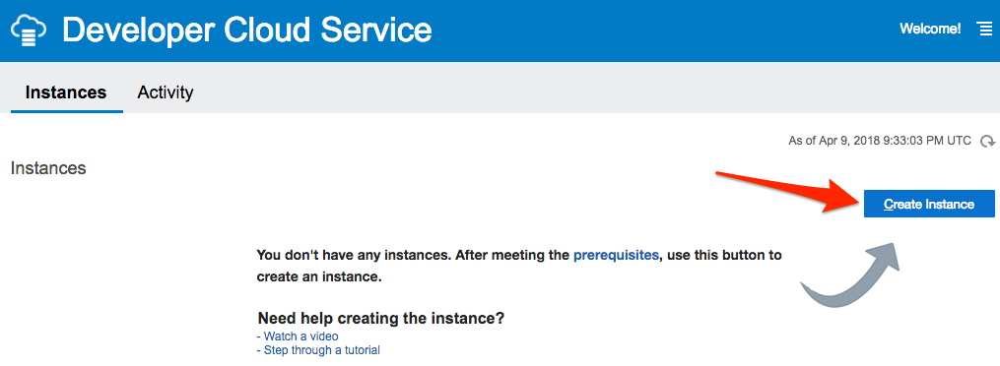

- Enter the following:

    **Instance Name**: `DevCS`

    **Description**: `DevCS Instance`

    **Notification Email**: Your account email should automatically show

    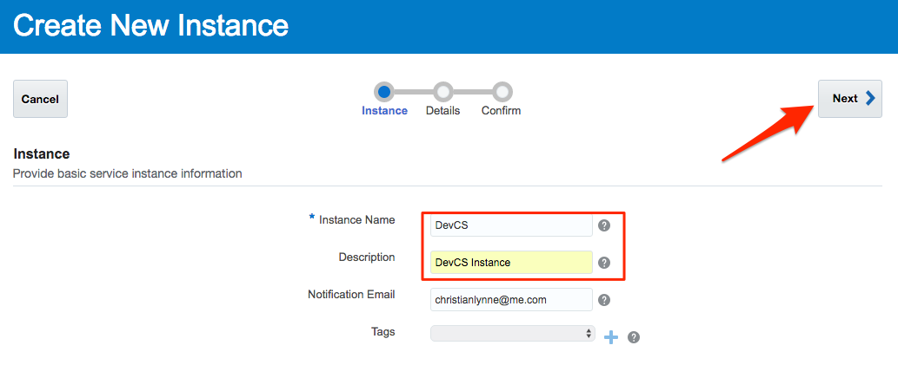

- Click **Next** on the Service Details Page.

- Click **Create** to create the DevCS Instance.

    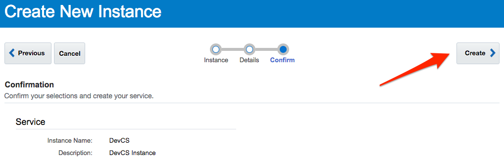

- The **DevCS** instance will show a Status of **Creating service...** for some time as the software/image to support your developer cloud services is being started and configured.

    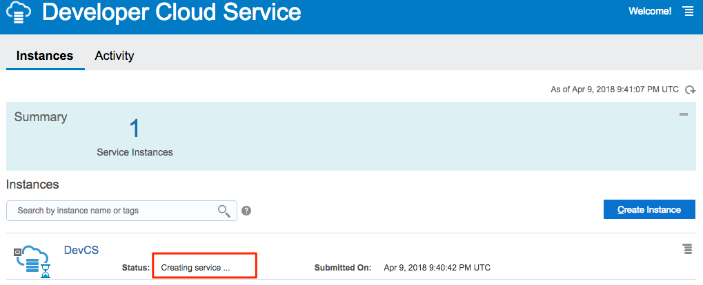

- Once the Instance is ready, it will show a **Created On** date. You can periodically click on the refresh icon to refresh the page. You can also click on the **Activity** tab to see log information. 

    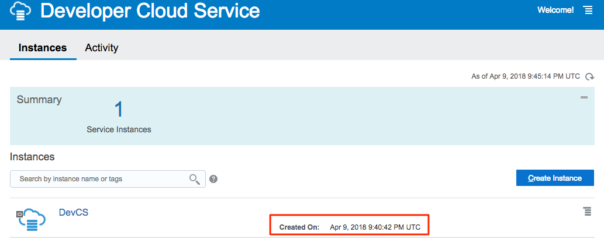

- Click on the **Hamburger Menu** to the right of the DevCS Services, and then click on **Access Service Instance** to load the Developer Cloud Service Console. If you happen to receive a message saying that the ***Page isn't working***, click on the **Reload** button.

    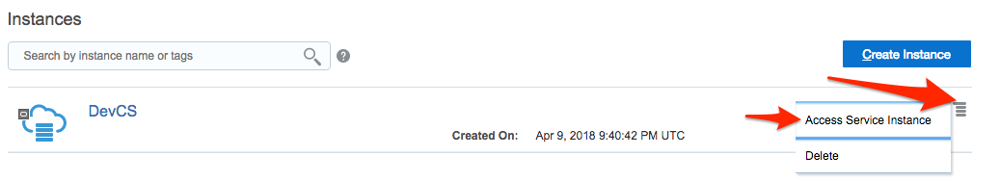

## Create Developer Cloud Service Project

### **STEP 3**: Create Developer Cloud Service Project

- Click **New Project** or **Create Project** to start the project create wizard. 

    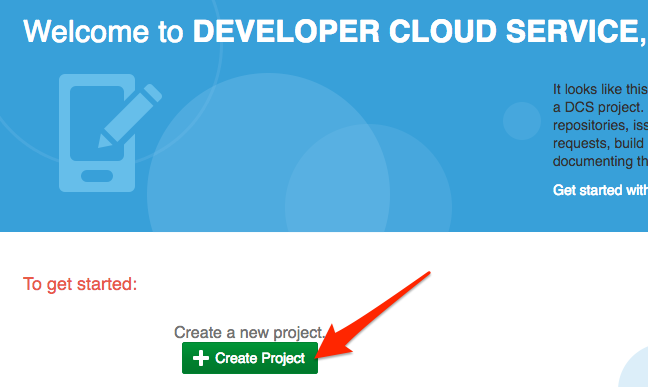

- On the Details screen, enter the following data and click on **Next**.

    **Name:** `Alpha Office Product Catalog Project`

    **Description:** `Alpha Office Product Catalog Project`

    **Note:** A Private project will only be seen by you. A Shared project will be seen by all Developer Cloud users. In either case, users need to be added to a project in order to interact with the project.

    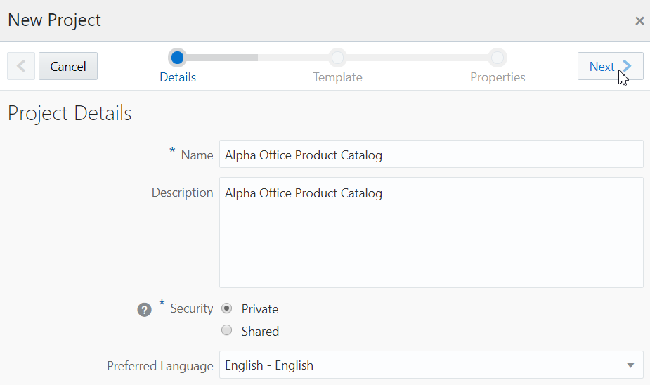

- Leave default template set to **Empty Project** and click **Next**

    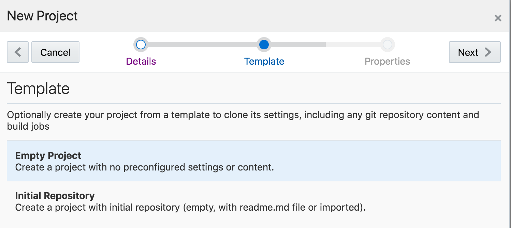

- Select your **Wiki Markup** preference to **MARKDOWN** and click **Finish**.

    

- The Project Creation will take about 1 minute.

    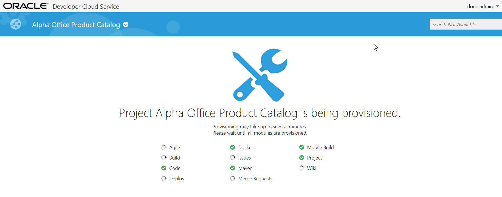

- You now have a new project, in which you can manage your software development.

    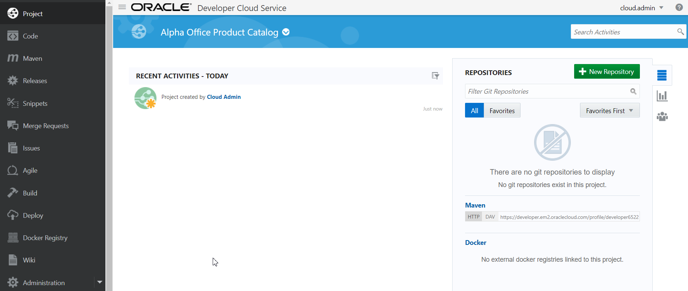

# Create Product Issues

## Create Issues for Twitter Feed Microservice

### **STEP 4**: Create Issue for the initial GIT Repository Creation

In this step you are still assuming the identity of the Project Manager, ***Lisa Jones***.

- Click **Issues** on left hand navigation panel to display the **Track Issues** page. Click **New Issue**. Enter the following data in the New Issue page and click **Create Issue**.

    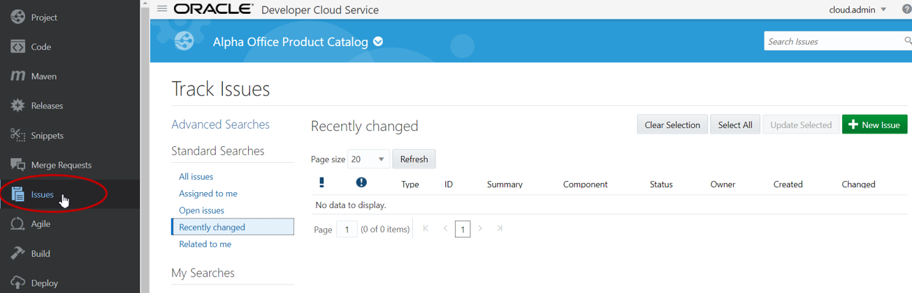

    **Note:** Throughout the lab you will assign your own account as the “physical” owner of the issue, but for the sake of this workshop, **Bala Gupta** will be the “logical” owner of the following issues.

    

    **Summary:**
    `Create Initial GIT Repository for Twitter Feed Service`

    **Description:**
    `Create Initial GIT Repository for Twitter Feed Service`

    **Type:** `Task`

    **Owner:** `Select your account provided in the dropdown [Logical Owner = Bala Gupta]`

    **Story Points:** `1`

    Note: Story point is an arbitrary measure used by Scrum teams. They are used to measure the effort required to implement a story. This [Site](https://agilefaq.wordpress.com/2007/11/13/what-is-a-story-point/) will provide more information. 

    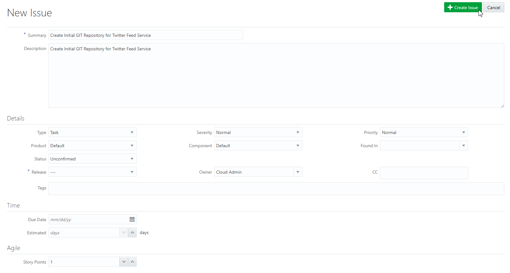

### **STEP 5**: Create Issue for Update Twitter Service

- Click **New Issue**. Enter the following data in the New Issue page and click **Create Issue**.

    

    **Summary:** `Create Filter on Twitter Feed`

    **Description:** `Create Filter to allow user to supply text to reduce the amount of data returned by the Twitter feed`

    **Type:** `Feature`

    **Owner:** `Select your account provided in the dropdown [Logical Owner: Bala Gupta]`

    **Story Points:** `2`

    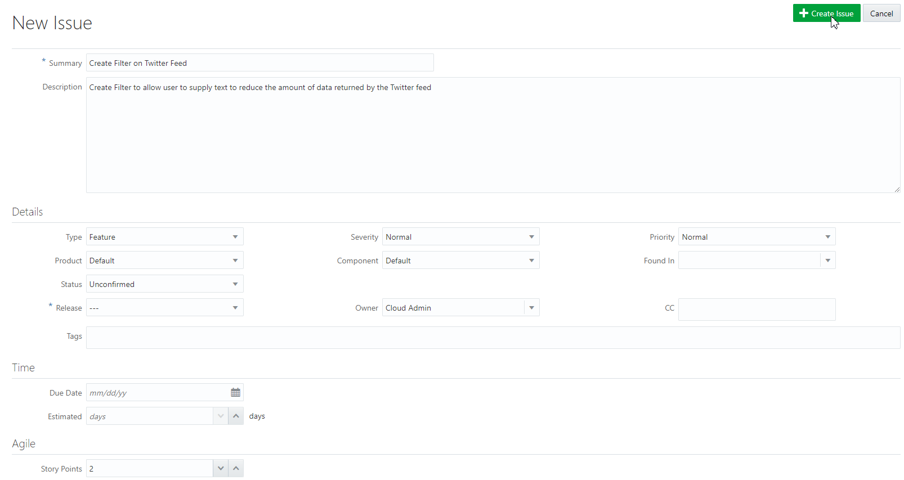

### **STEP 6**: Create Issue for development of Database Microservice

- Click **New Issue**. Enter the following data in the New Issue page and click **Create Issue**. Issue will logically be owned by **Roland Dubois**.

    

    **Summary:** `Create Microservice to allow access to Product Catalog data`

    **Description:** `Create Microservice to allow access to Product Catalog data`

    **Type:** `Feature`

    **Owner:** `Select your account provided in the dropdown [Logical Owner: Roland Dubois]`

    **Story Points:** `2`

    

### **STEP 7**: Create Issue for Development of Product Catalog UI

- Click **New Issue**. Enter the following data in the New Issue page and click **Create Issue**. Issue will logically be owned by **John Dunbar**.

    

    **Summary:** `Create Alpha Office Product Catalog UI`

    **Description:** `Create Alpha Office Product Catalog UI making use of the new Microservices`

    **Type:** `Feature`

    **Owner:** `Select account provided in the dropdown [Logical Owner: John Dunbar]`

    **Story Points:** `2`

    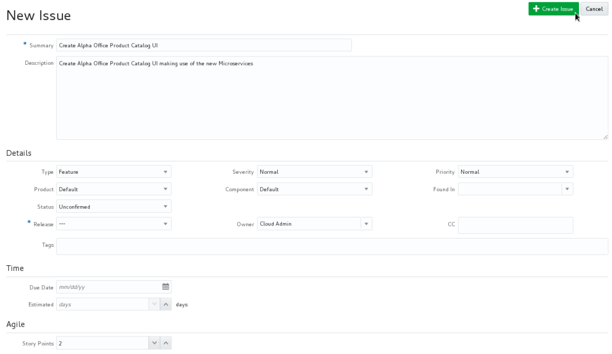

- Click the back arrow  on the **left side** of the window, or click on the **Issues** menu option to view all newly created issues.

    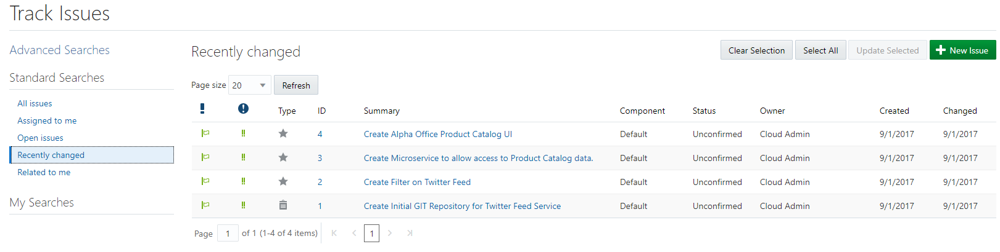

# Create Agile Board

## Create Agile Board and Initial Sprint

### Developer Cloud Service Agile Page Overview

Before you start using the Agile methodology in Oracle Developer Cloud Service, it is important that you know the following key components of the Agile page.

- **Board** – A Board is used to display and update issues of the project. When you create a Board, you associate it with an Issue Query. The Board shows Issues returned by the Query.
You can either use a Board created by a team member, or create your own Board. You can create as many Boards as you like.
- **Sprint** – A Sprint is a short duration (usually, a week or two) during which your team members try to implement a product component.
You add the product component related issues to a Sprint. When you start working on a product component, you start (or activate) the related Sprints. To update issues using a Sprint, you must first activate the Sprint and add the Sprint to the Active Sprints view.
- **Backlog view** – Lists all Issues returned by the Board’s Query. The view also displays all active and inactive Sprints of the Board, and the sprints from other Boards that contain Issues matching the Board’s Query.
Each Sprint lists issues that are added to it. The Backlog section (the last section of the Backlog page) lists all open issues that are not part of any Sprint yet. The Backlog view does not show the resolved and closed Issues.
- **Active Sprints view** – Lists all active Sprints of the Board and enables you to update an Issue status simply by dragging and dropping it to the respective status columns.
- **Reports view** – select the Burndown Chart tab to display the amount of work left to do in a Sprint or use the Sprint Report tab to list open and completed Issues of a Sprint.

### **STEP 8**: Create Agile Board

- Click **Agile** on the Left Side Menu to display a page listing all existing Boards

    

- Click **New Board** and enter the following data. When done click **Create**.

  **Type:** `Scrum`

  **Name:** `Microservices`

  **Estimation:** `Story Points`

    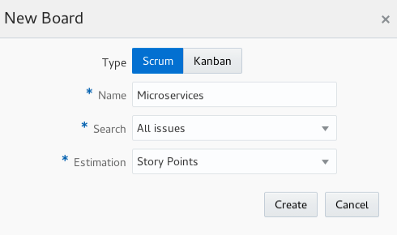

### **STEP 9**: Create Sprint
- We will now create our first Sprint. Click **New Sprint**. Enter the following data and click **OK.**

    **Name:** `Sprint 1 - Initial Development`

    **Story Points:** `7`

    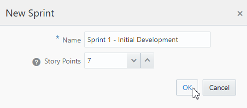

### **STEP 10**:	Add Backlog Issues to Sprint

- Next, we want to add the backlog issues to the newly created sprint. **Drag and drop** the **4 issues** one at a time upward onto the **Sprint 1** section. This will add the issues to the sprint.

    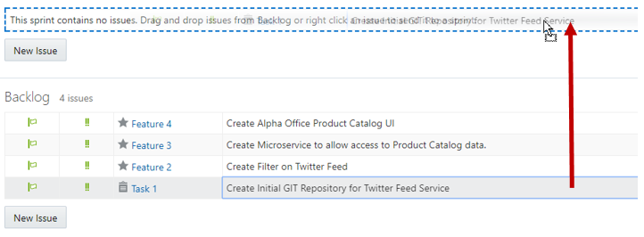

- After dragging all the issues, your Sprint Issues should appear as shown below:

    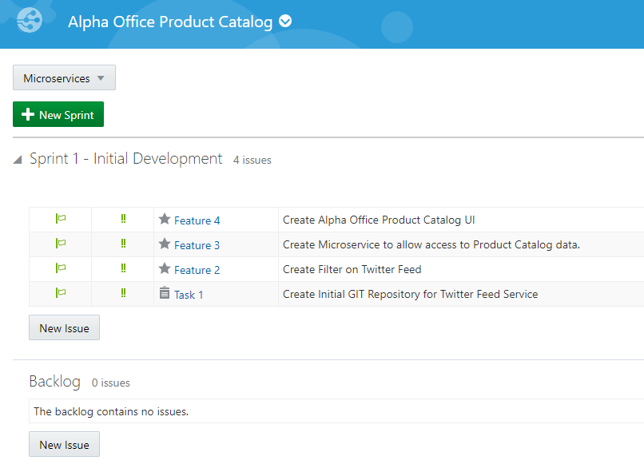

### **STEP 11**: Start Sprint

- Click the **Start Sprint** button.

- Leave the defaults and click **Start**

    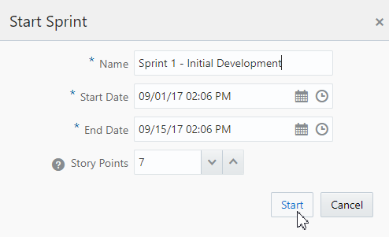

- Now click on **Active Sprints** to view the Sprint Dashboard

    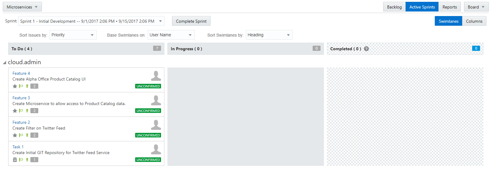

- Click on the **Reports** button to view the Burndown and Sprint reports.

    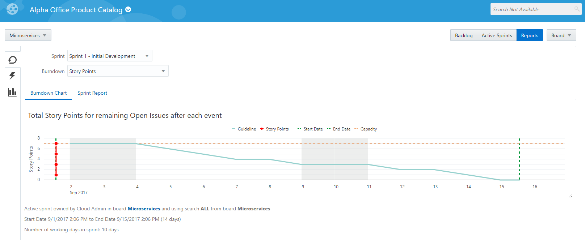

# Prepare Build Server Infrastructure

## Configure and Setup Infrastructure

### **STEP 12**: Setup Storage Connection

In this step we are going to configure an Image that can be used to perform the Build functions to be executed in later labs, but we'll get those steps out of the way now.

- Click on your **User Name** in the top right corner of the window. Then click on **Organization**.

    

- Let's first configure the connection to the Storage Cloud Service so our build process will have a place to store the build artifacts. Click on **Storage** in the right hand menu. 

    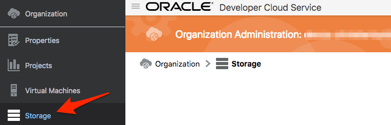

- Click on the **New Configuration** button.

    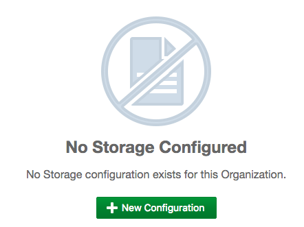

- The following dialog will be displayed. We are now going to fill in the values numbered below as **1, 2, 3 and 4**. Keep this dialog open in a Tab, but we'll get these values by returning to the **Main Dashboard** tab displayed when you first logged into your Oracle Cloud Account. If that tab is no longer available, you can login again following the steps at the first of the lab

    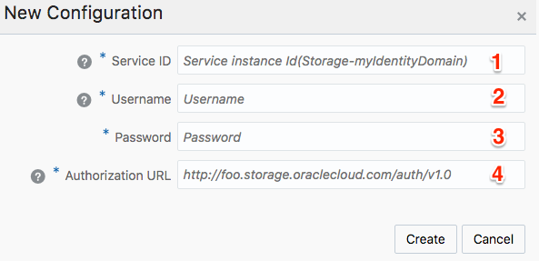

- From the Main Dashboard, click on the **Storage Classic** Service.

    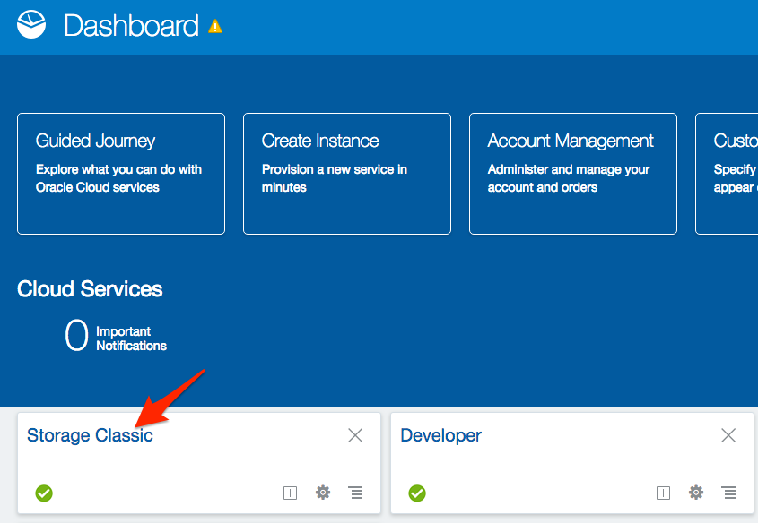

- You will now use the following pieces of data from this screen to fill in the **New Configuration** dialog.

    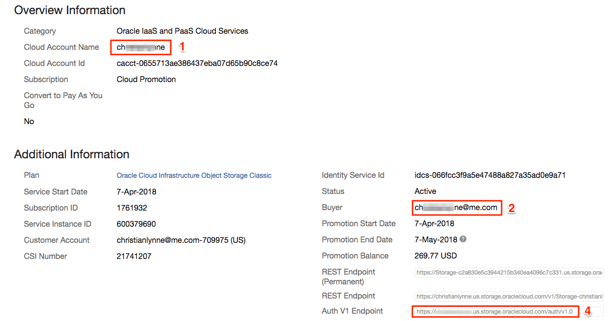

- Return to the tab/window with the **New Configuration** dialog:
    - In **Field 1. Service ID**, ***append*** the word "`Storage-`" to the front of the **Cloud Account Name** - e.g. `Storage-myaccountname`.
    - In **Field 2. User Name**, copy and paste the **Buyer** email address. e.g. `myaccountname@me.com`.
    - In **Field 3. Password**, enter your account Password.
    - In **Field 4. Authorization URL**, copy and past the **Auth V1 Endpoint**
    - Click on the **Create** Button.

    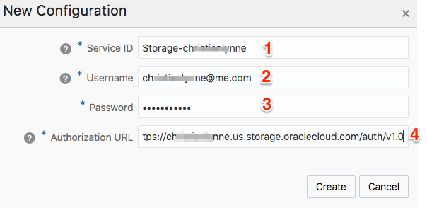
    

- After your Configuration is accepted, click on **Test Connection**

    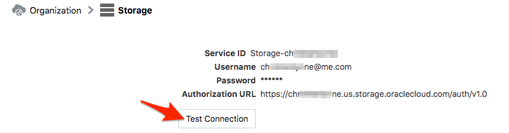

- **Connection Successful** should appear next to the Test Connection button.

    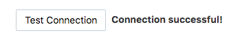

### **STEP 13**: Setup Connection to Computer Services

- Now we will configure the Virtual Machine Templates and Machines to support the build processes in future labs. Click on **Virtual Machines** in the left hand menu. Then click on the **Configure Compute Account** button.

    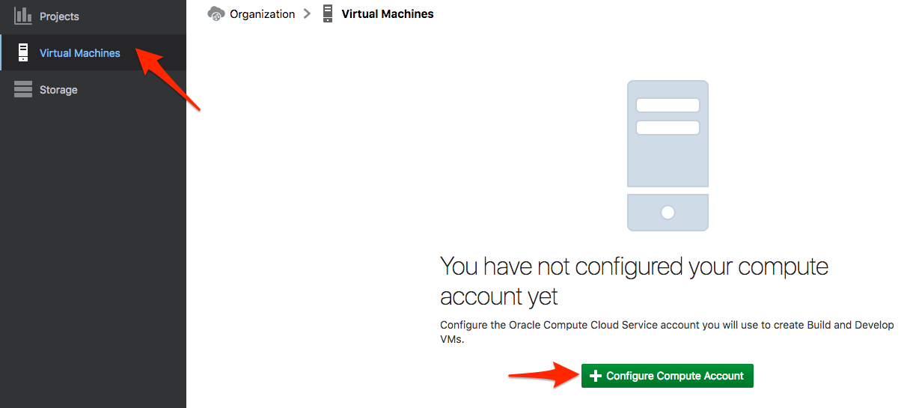

- The following dialog will be displayed, and we will fill in fields labeled **1, 2, 3 and 4** using data from the **Classic Compute** console.

    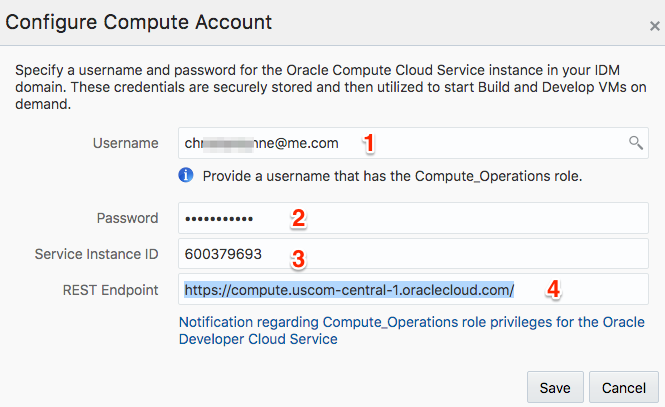

- We next need to go to the the **Classic Compute** Console. To get to that console, return to the tab/window with the **Storage Classic** dashboard. From that tab/window, click on the **Dashboard** icon on the top right corner of the screen.

    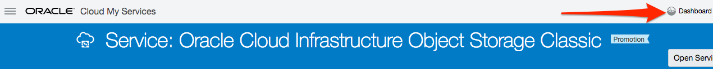

- From the main dashboard, click on the **Compute Classic** dashboard link.

    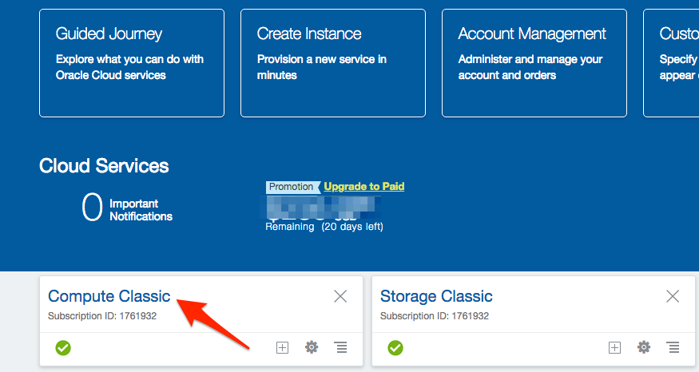

- Use the information from this screen to fill in the **Configure Compute Account** dialog.

    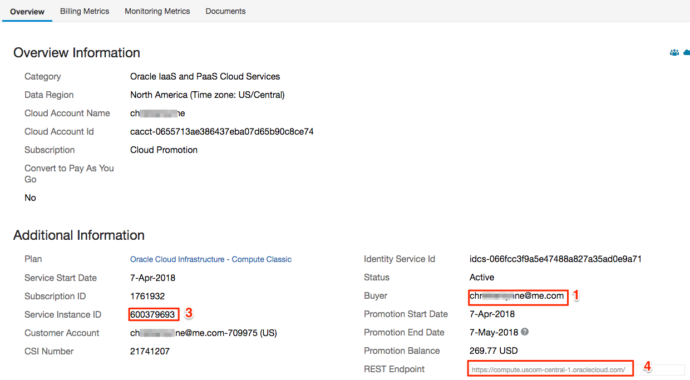

- Return to the tab/window with the ***Configure Compute Account** dialog.
    - In **Field 1. User Name**, copy and paste the **Buyer** email address. e.g. `myaccountname@me.com`.
    - In **Field 2. Password**, enter your account Password.
    - In **Field 3. Service Instance ID**, copy and paste the **Service Instance ID**
    - In **Field 4. REST Endpoint**, copy and paste the **REST Endpoint**.
    - Click on the **Save** Button. If you entered everything correct, the configuration will be accepted.

    

### **STEP 14**: Create Builder Server Template

- Before we create a New VM for the Build Server, we need to define a template that the build server(s) can use. Click on the **VM Templates** option in the Left Hand menu. If the **VM Templates** option _is not visible_, just reload this page.

    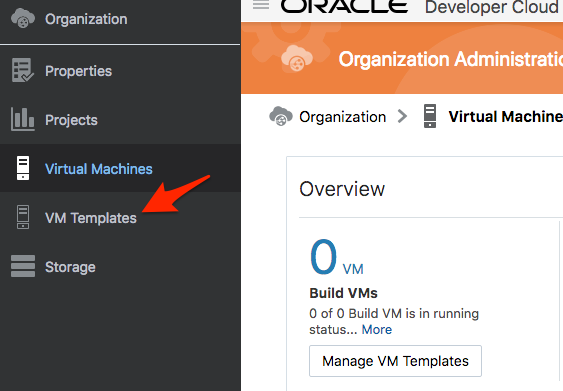

- Click on the **New Template** button.

    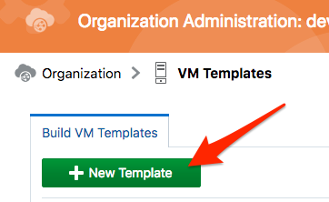

- Name the new Template `OELNodeJava` and set the Platform to **Oracle Linux 7**, Click on the **Create** button.

    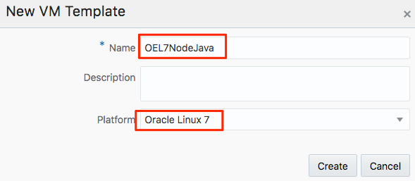

- Click on the **Configure Software** button.

    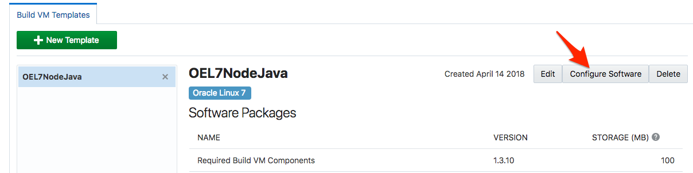

- Click on **Node.JS v8.x** from the list of available software to add to this build image template. _Double check the version you selected_. Notice that along with the version of Node.js that you just added, that this template already includes the **Required Build VM Components**, which includes Git, Java, JUnit, Maven, Ruby and Ant. Click on the **Done** button.

    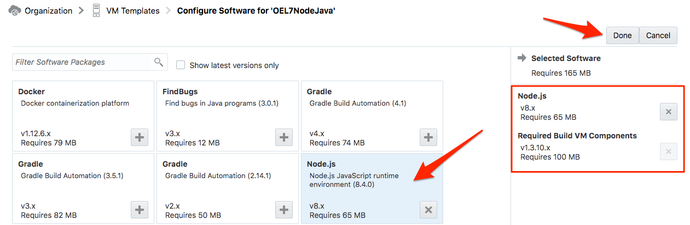

### **STEP 15**: Create the Build Server Image

- Click on the **Virtual Machines** left hand menu option, and then click on **New VM**.

    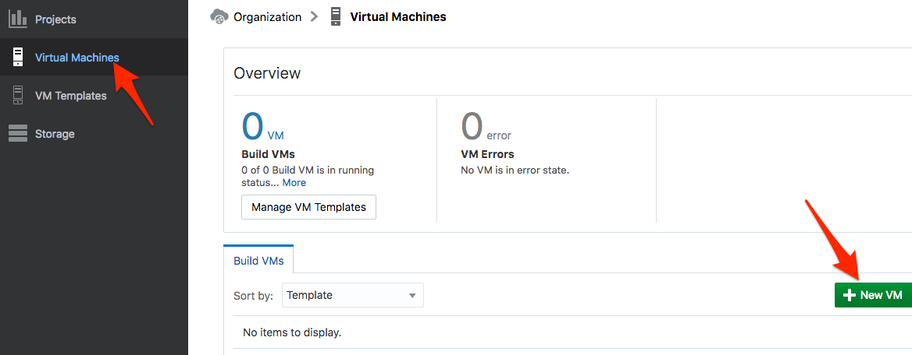

- **Leave the defaults** and and click on **Add**. We are leaving the Quantity set to **1** build server running. If you needed to support many users running builds concurrently, and if you had the capacity, the number of build images could be increased. Also, use the new VM Template **OEL7NodeJava** that we just created.

    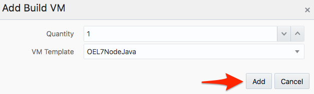

- Click on the **Sleep Timeout** button.

    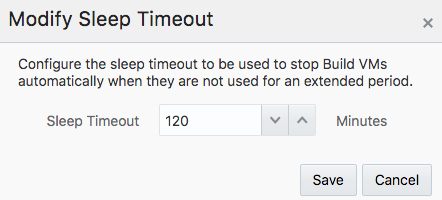

- Change the Sleep Timeout to `120` Minutes and click on **Save**. Once the first build starts the Build Server image, it will remain running for any subsequent builds that we do in this workshop, ensuring better performance. This number can be adjust base on performance vs cost needs.

    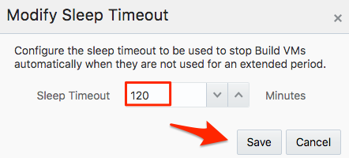

- Click on the **Close** button in the top right corner to return to the main Developer Cloud Service Dashboard.

    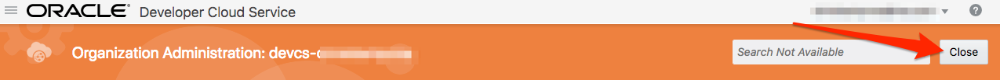

- **You are now ready to move to the next lab.**
