# Continuous Delivery of Java Microservices


Updated: April 17, 2018

## Introduction

This is the second of several labs that are part of the **Oracle Cloud DevOps and Cloud Native Microservices workshop.** This workshop will walk you through the Software Development Lifecycle (SDLC) for a Cloud Native project that will create and use several Microservices.

In the first lab (100), the Project Manager created a new project in the Developer Cloud Service and also created and assigned tasks to the developers of this application. In this lab you will assume the persona of the Java developer, who will be tasked with creating a microservices that will allow for retrieval and filtering of twitter data.

## Objectives

- Access Developer Cloud Service
- Import Code from external Git Repository
- Build and Deploy project using Developer Cloud Service and Oracle Application Container Cloud Service
- Clone the Git Repository Locally, and update the code to add a filtered search feature.
- Commit to a new branch, and merge the new feature, build and deploy.

## Required Artifacts

- The following lab requires an Oracle Public Cloud account that will be supplied by your instructor. You will need to download and install latest version of Eclipse or used supplied compute VM. Instructions are found in the Student Guide.

# Create Initial Static Twitter Feed Service

## Explore Developer Cloud Service

### **STEP 1**: Review Agile Board

- This Lab assumes that you just completed Lab 100 and are still connected to the Oracle Cloud, that you're still in the Developer cloud Service Dashboard, and you're viewing the "Alpha Office Product Catalog Project". If for some reason that is not the case, follow the first several Steps of Lab 100 to once again view the Developer Cloud Service Console.

    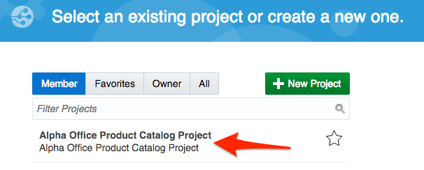

 
- Although you will remain connected to the Oracle Cloud using the user account you were provided, you will take on the Persona of ***Bala Gupta*** as you perform the following steps.

      

- Within the **Alpha Office Product Catalog Project**, click on **Agile** found on the left hand navigation.

      

### **STEP 2**: Display the Active Sprint

- On the **Microservices** Board, click **Active Sprints**

    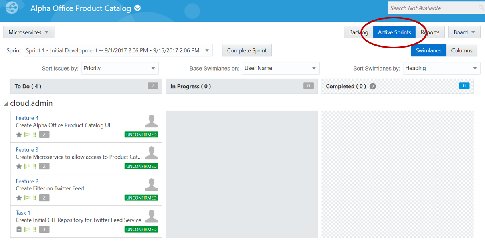  

## Create Initial Git Repository

### **STEP 3**: Create Initial Git Repository

To begin development on our Twitter feed microservices, we could start coding from scratch. However, prior to the formal kickoff of this project, you (as Bala Gupta) have already started doing some proof-of-concept development outside of the Developer Cloud Service in order to assess the feasibility of your assignment. You want to bring that existing code into the Developer Cloud Service as a starting point for your microservices. You will do that by cloning your external GIT repository into the Developer Cloud Service. Your first step will be to accept your task using the agile board.

- Drag and drop **Task1 - Create Initial GIT Repository for Twitter Feed Service** into the **In Progress** swim-lane.  

    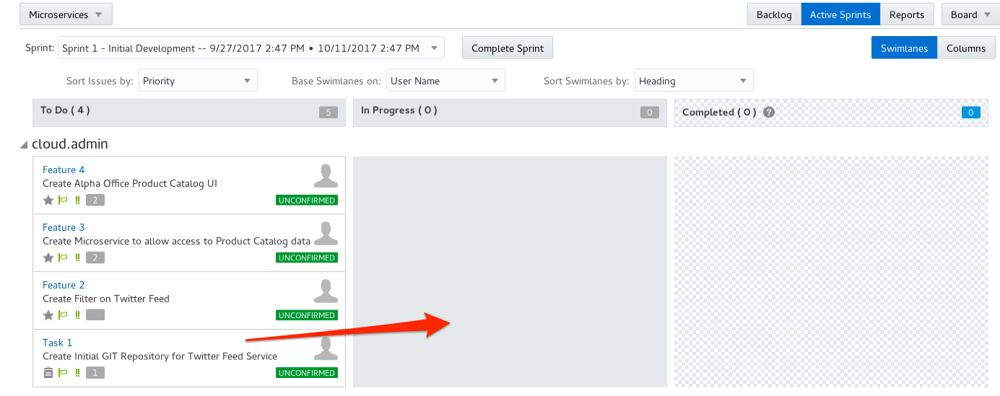  

- Leave the defaults, and Click **OK**.

    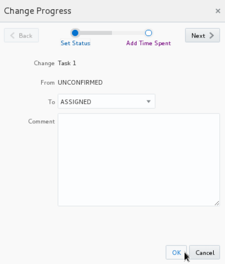  

- Your Sprint progress will appear as shown below.

      

- In the left hand navigation panel, click **Project**

- On the right side in the **REPOSITORIES** section, click on **New Repository** to create a new Git Repository.

      

- In the New Repository wizard enter the following information and click **Create**.

    **Name:** `TwitterFeedMicroservice`

    **Description:** `Twitter Feed Microservice`

    **Initial content:** `Import existing repository`

    **Enter the URL:** `https://github.com/pcdavies/TwitterFeed.git`

    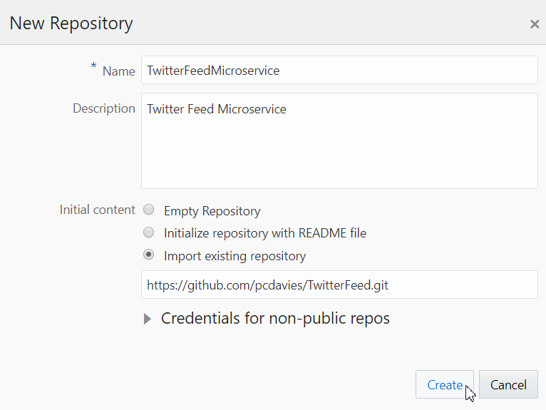  

- You have now created a new GIT repository stored within the Developer Cloud Services that is based on an existing repository.

    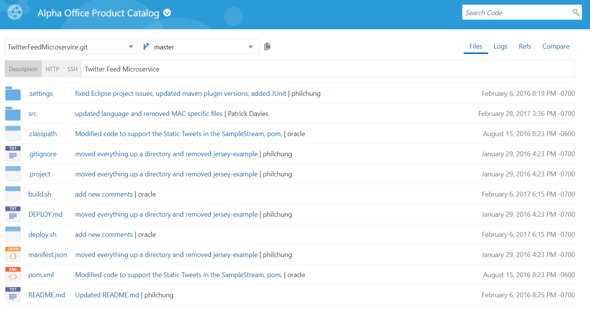  

## Create Default Build and Deployment Process

### **STEP 4**: Create Default Build Process

Now that we have the source code in the Developer Cloud Service managed GIT repository, we need to create a build process that will be triggered whenever a commit is made to the master branch. We will set up a Maven build process in this section.

- On the left side navigation panel, click **Build** to access the build page and click **New Job**.

      

- In the New Job popup enter the following:

    **Job Name**: `TwitterFeedBuild`

    Select **Create New**

     **Software Template**: `OEL7NodeJava`

    click **Create Job**.

    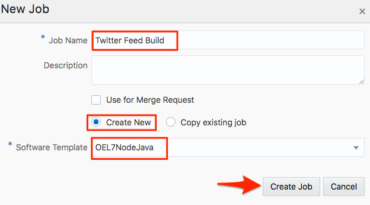  

- You are now placed into the job configuration screen. Click on the **Add Source Control** button, and select **Git**.

    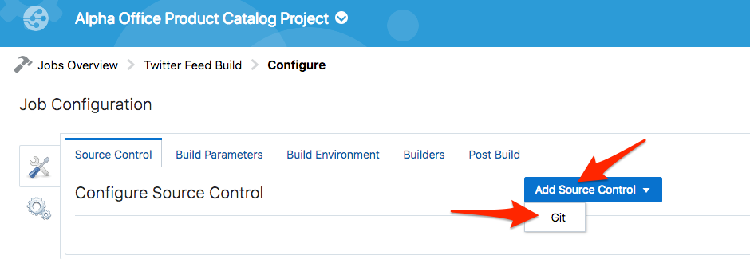

- Select the `TwitterFeedMicroservice.git` for the **Repository**. Click on the **Automatically perform build on SCM commit**, and click on the **Builders** tab.

    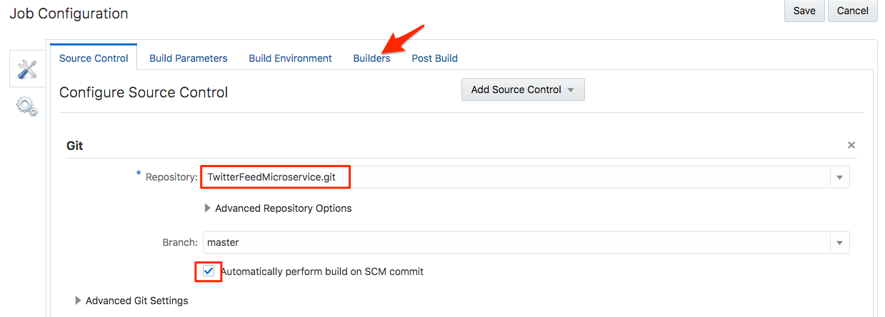

- In the Builders tab, click on **Add Builder** and then click on **Maven Builder**.

    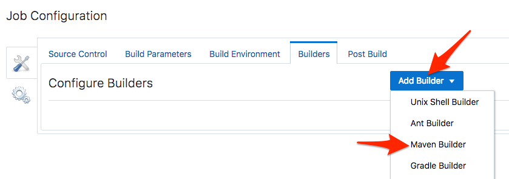

- Set the **Goals:** `clean assembly:assembly` 
- Click on the **Post Build** tab.

    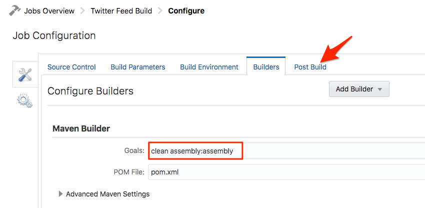

- Click on the **Add Post Build Action**, and select **Artifact Archiver**.

    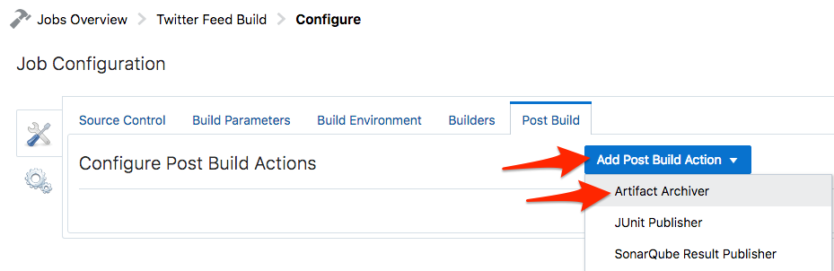

- Enter and set the following:

    **Files to archive**: `**/target/*`

    **Archive Maven Artifacts**. 

    **Compression** set to **GZIP**.

    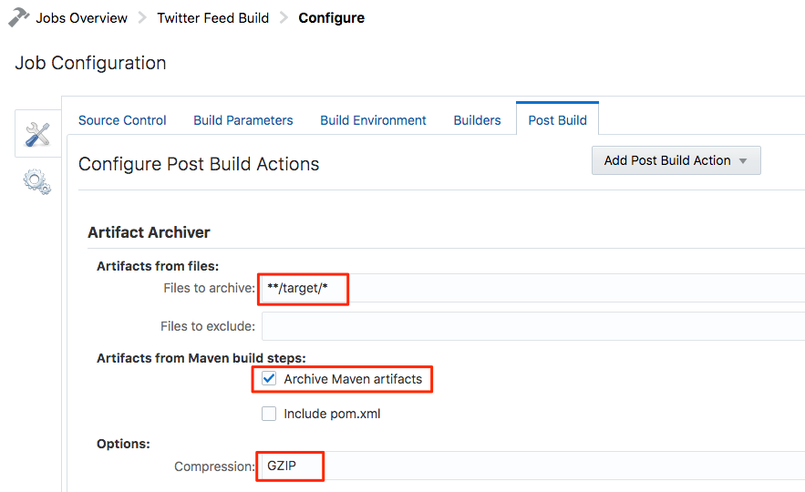

- Click on the **Add Post Build Action** button and select **JUnit Publisher**.

    

- Leave the defaults of **Include JUnit XMLs** set to: `**/surefire-reports/*.xml`
- Select **Archive Media Files**.

    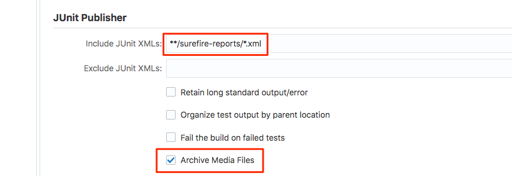

- Click on the **Gear Icon**, then click on the **Software** tab. We will leave the default **Java** setting as **8: Includes Git, Java, JUnit, Maven, Ruby and Ant.**

    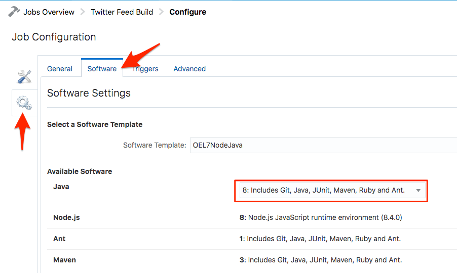

- Click on **Save** to save this Job Configuration.

    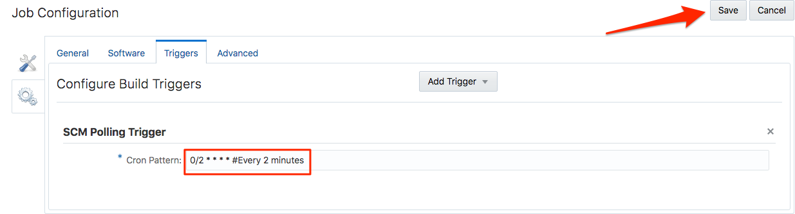

- Within a few minutes the Cron job will start the build, or you can also start the build job my click on the **Build Now** button. Notice that the Build will show **Waiting for Executor**. This is because the Build Image you configured earlier is now being configured and started to support your builds.

    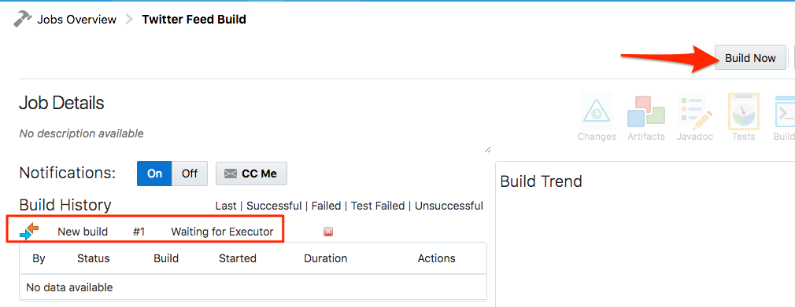

- It can take about 15 minutes the first time the build image is used, as the image must be started, and then the needed software is provisioned in the image. Once the status changes to **Building**, you can optionally click the **Build Log** button to view the build logs. 

    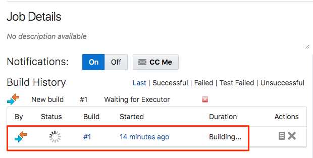

- Once the build successfully completes, you'll see the following screen.

    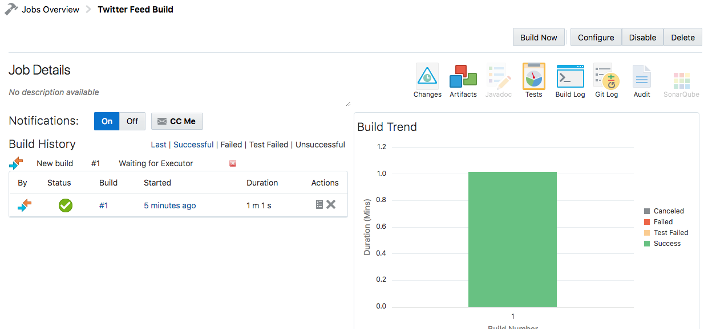

### **STEP 5**: Create Default Deployment Process

Now that you have successfully built your project, you need to create a deployment configuration that will watch for stable builds and deploy them to a new Application Container Cloud Service instance for testing.

- On the navigation panel click **Deploy** to access the Deployment page. Click **New Configuration**.

      

- Enter the following data:

  **Configuration Name**: `TwitterFeedMicroserviceDeploy`

  **Application Name**: `JavaTwitterMicroservice`

      

- To the Right of Deployment Target, click **New** and select **Application Container Cloud**

      

- The following dialog will be displayed, and in the next task we will show how to locate the data required to create the connection.

    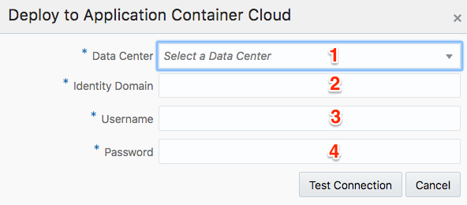  

- To located the needed connection fields, return to, or open a new tab displaying the main Cloud Services. Click on the **Application Container** service link.

    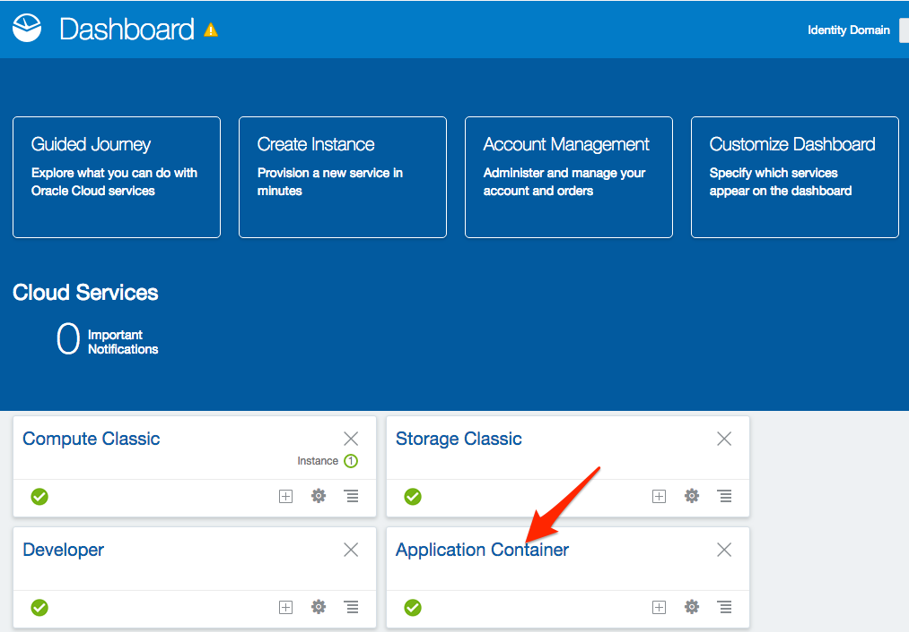  

- We will now use the information in the **Application Container** Dashboard to populate the **Deploy to Application Container Cloud** dialog. ***In this example:*** we will use the following information:

    - **Data Center**: In this example, we'll select `US Commercial 1 or 2`,  because the **Data Region** for the service is in US/Central.
    - **Identity Domain**: Copy and paste the **Identity Service ID**
    - **Username**: Copy and past the **Buyer** field.
    - **Password**: Your account's password.
    - Click on **Test Connection**

    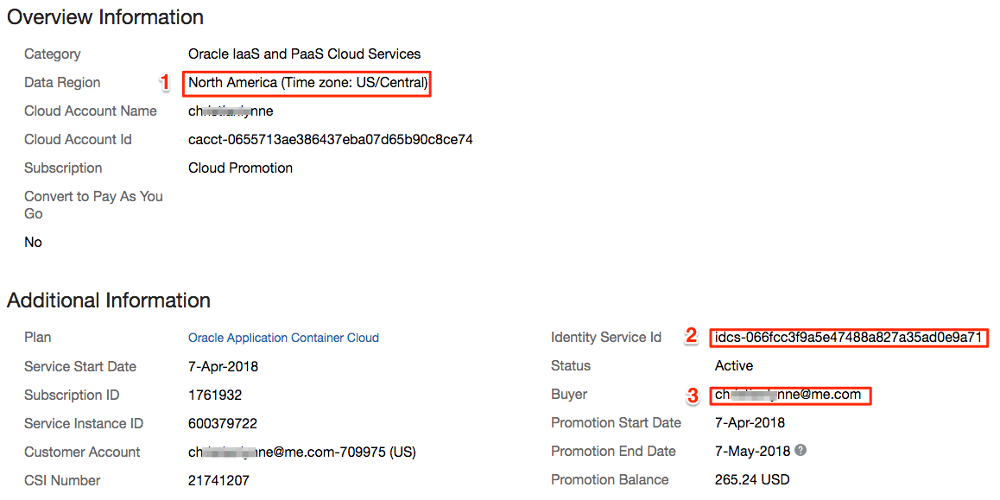  

    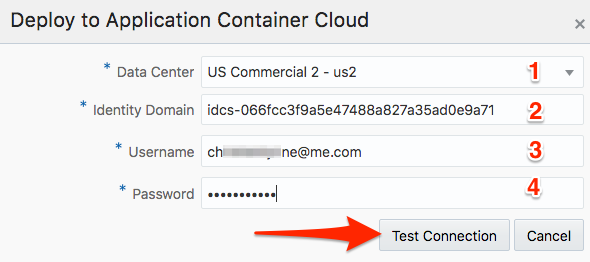  

- When you have the correct connection information, that test should return **Successful**. Click on **Use Connection**. 

    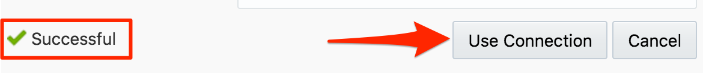  

    **Note:** If you are not able to connect, double check you credentials. If your connection still does not work, and this is an **Oracle Trial account**, please review the Student Guide for this workshop, and follow the steps outlining how to set your **Storage Replication Policy**.  

- Set the following Properties as follows:

  - **Runtime**: `Java`

  - **Subscription**: `Hourly`

  - **Type:** `Automatic` and `Deploy stable builds only`

  - **Job:** `Twitter Feed Build`

  - **Artifact:** `target/twitter-microservice-example-dist.zip`

  - To reduce the number of resources that are used we will modify the default deployment of 2 instances. Click **Include ACCS Deployment** and enter the following in the text box:

    ```
    {
        "memory": "2G",
        "instances": "1"
    }
    ```

    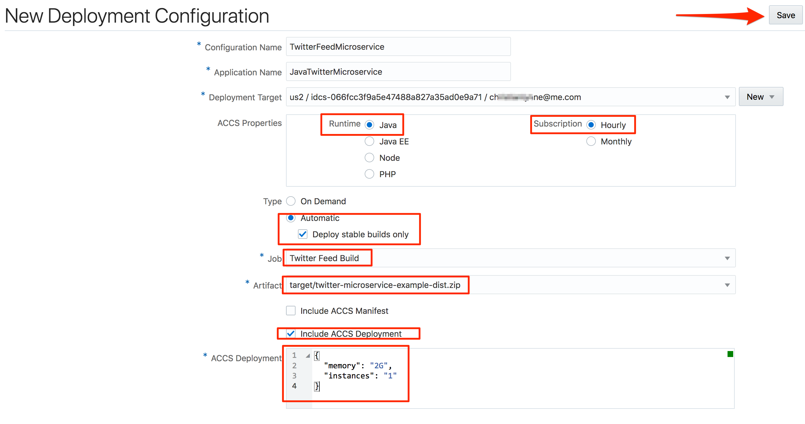  

- Once you have entered all the fields correctly, click on **Save**

      

- Click the gear drop down and select **Start**

      

- Wait until the message **Starting application** changes to **Last deployment succeeded**

      

      

- **Note**: You possibly may receive the following message in the header. If the status of the deployment is still showing **Starting** or **Deploying**, close this error message and wait for the deployment status to show failed or success, as the deployment may automatically retry and successfully complete.

    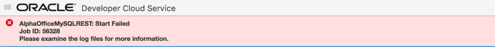

## Verify Twitter Feed Microservice deployment

### **STEP 6**: Login to Oracle Application Container Cloud Service

- Return to the tab containing the **Application Container Cloud** service you loaded off of the **main dashboard**. Click on the **Open Service Console** window.

    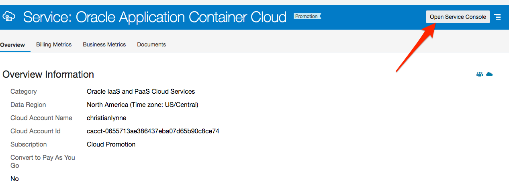  

- On the Application Container Cloud Service (ACCS) Service Console you can view all the deployed applications, including our newly created **JavaTwitterMicroservice**. Click on the **URL**, and it will load a new browser tab. Alternatively, copy and paste the URL into the address bar of a new browser tab.

      

- _Append_ the following to the end of the URL in the browser: `/statictweets`

    **Note:** The URL should return a JSON array containing a Static Twitter feed. If you desire to see a formatted view of the JSON, and you are using Chrome, open a new tab and search Google for **JSONViewer chrome plugin** – After you install the Chrome Plugin and re-submit the URL, you will be able to view the JSON in a more readable format.

    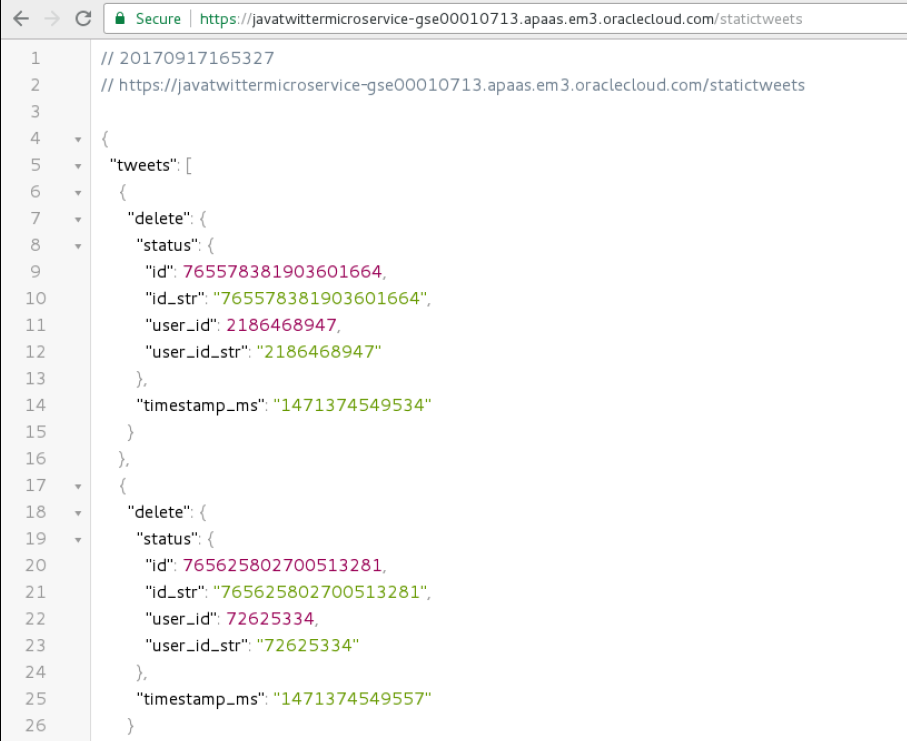  

### **STEP 7**: Complete Task

We have now verified that the statictweets microservice has been deployed and functions properly. To finish up this part of the lab, we will mark the Issue as completed in the Sprint.

- Back in the Developer Cloud Service window, click **Agile**, followed by clicking **Active Sprints**.

- Drag and drop **Task 1** from **Verify Code** to **Completed**.

    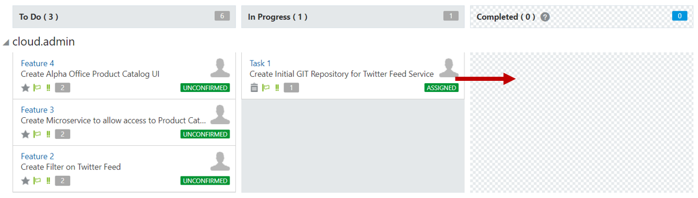  


- In the Change Progress popup click **Next**.

    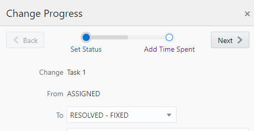  

- In the **Add Time Spent** popup, set the **Time Spent** to `1` and click **OK**.

      

- Your Sprint should now look like the following:

    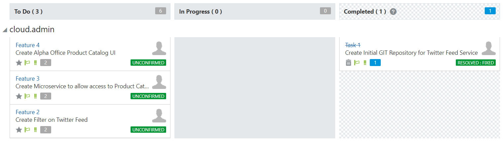  

- You can also click on the **Reports** button and view your progress in the **Burndown Chart** and **Sprint Report**.

    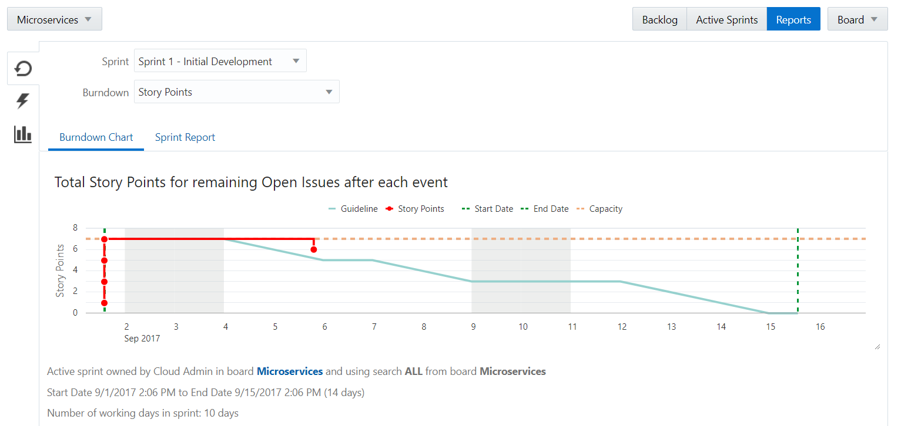  

# Add Filter to Static Twitter Feed Service

Now that we have completed the import, build, deployment, and verification of our initial static twitter microservice, it is time to extend the project by adding a new microservice that allows us to dynamically filter the incoming tweets based on their contents.

Normally you would you an Integrated Development environment like Eclipse to update update and test your code modifications locally, but for simplicity, we will download the Developer Cloud Service GIT repository locally, use an editor of your choice, and then commit and push the code back to the Developer Cloud Service GIT repository.

## Clone Repository Locally and Update Source Code

### **Step 8**: Install Git

- To record the progress of your next tasks, in the Developer Cloud Service window click **Agile**, followed by clicking **Active Sprints**.

- Drag and drop **Task 2** from **To Do** to **In Progress**.

    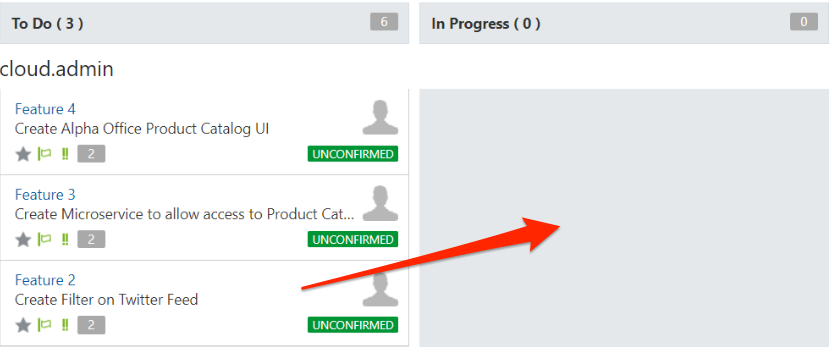  


- In the **Change Progress** popup click **OK**.


- If you did not install Git as part of the **Trial Account** Student guide, you can visit [https://git-scm.com/downloads](https://git-scm.com/downloads) to download and install GIT for your operating system. In the examples to follow, we will use Windows cmd window to execute the git commands, but these examples will work equally as well on Windows or a Mac.

- Open a **cmd** or **terminal** window and execute the command: 

    ```
    git --version
    ```

    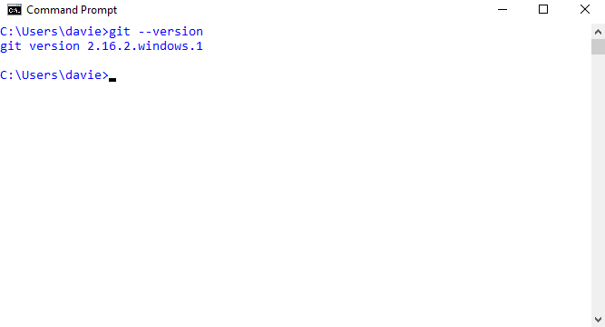  

### **Step 9**: Clone the GIT Repository to your laptop

- Back in the **Developer Cloud Service** Console, click on **Project** in the left hand menu. Then select the text in the **TwitterFeedMicroservice.git** URL, right-click and select **Copy**.

      

    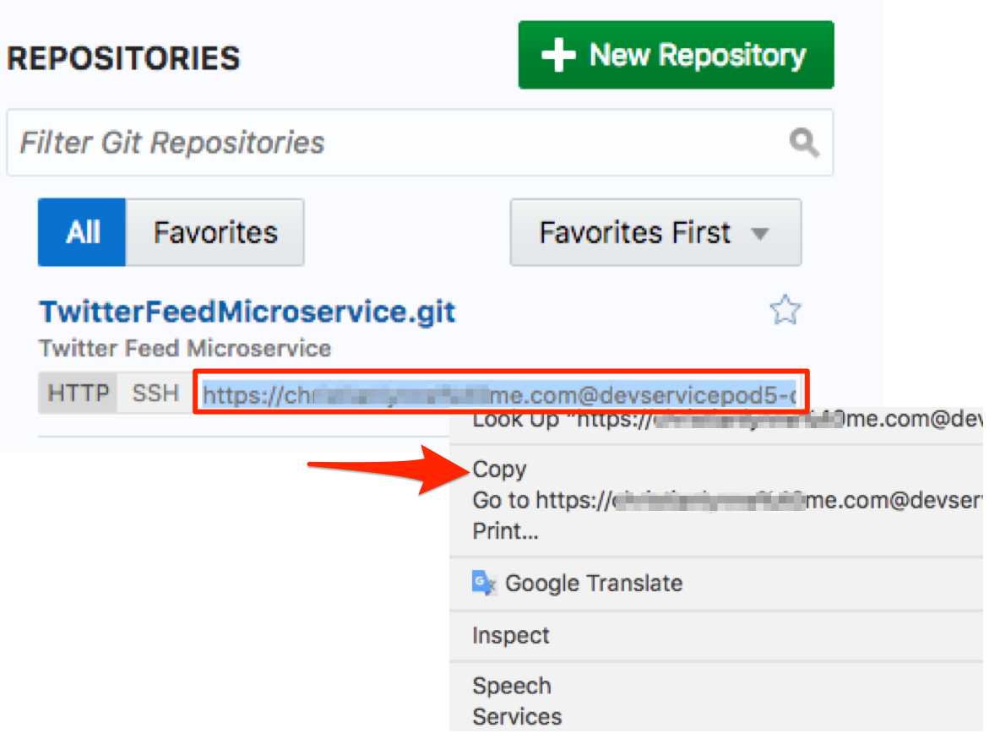  

- Enter the following into the **cmd/terminal** window, and **appending the URL** you just copied after the command 

    ```
    git clone https://THE_REPOSITORY_URL_YOU_COPIED
    ``` 

    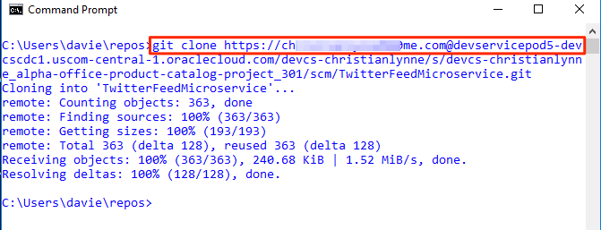  

- Now you will change to the **TwitterFeedMicroservice**, and you will create a new Branch titled **Feature2**. You will then **Checkout** that branch so all subsequent updates you make are contained in the Feature2 Branch. Use the following commands:

    ```
    cd TwitterFeedMicroservice
    git branch Feature2
    git checkout Feature2
    ```

### **Step 10**: Update the StaticTweets.java and MyServiceTest.java

- We need to modify the StaticTweets.java file so that it will perform filtering of Tweets. To do this, open the file **TwitterFeedMicroservices/src/main/java/com/example/StaticTweets.java**. Here is an example on Windows:

    ```
    notepad src/main/java/com/example/StaticTweets.java
    ```
      

- In your editor of your choice, locate the lines that begin with "**Remove this comment**". Removing these lines will cause the code previously surrounded by the comments to execute:

    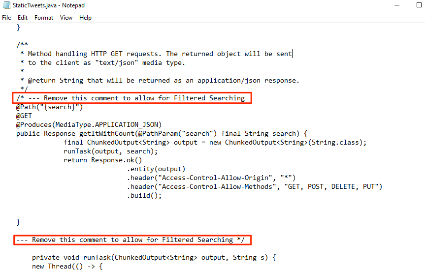  

- The file should now look like this. **Save** the file and close the Editor.

     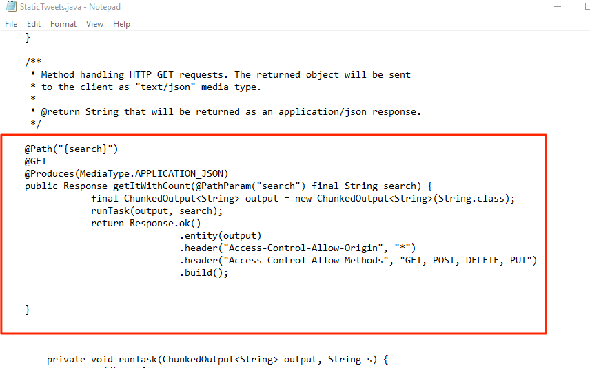  

- Now we need to update the test code that will be run whenever a build occurs. The Developer Cloud Service will provide graphs showing the results from the Tests run during the build. Open the file  **TwitterFeedMicroservices/src/test/java/com/example/MyServiceTest.java**. Here is an example on Windows:

    ```
    notepad src/test/java/com/example/MyServiceTest.java
    ```
     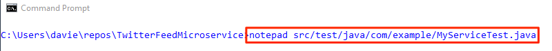  

- Search for the method **testGetStaticSearchTweets()** and remove the **Comment Lines** surrounding that method. 

     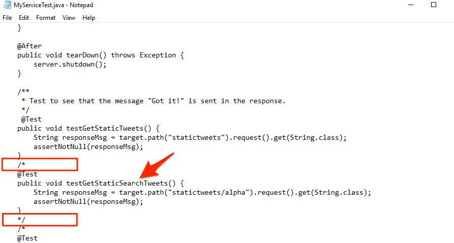  

- The file should now look like this. **Save** the file and exit the Editor.

     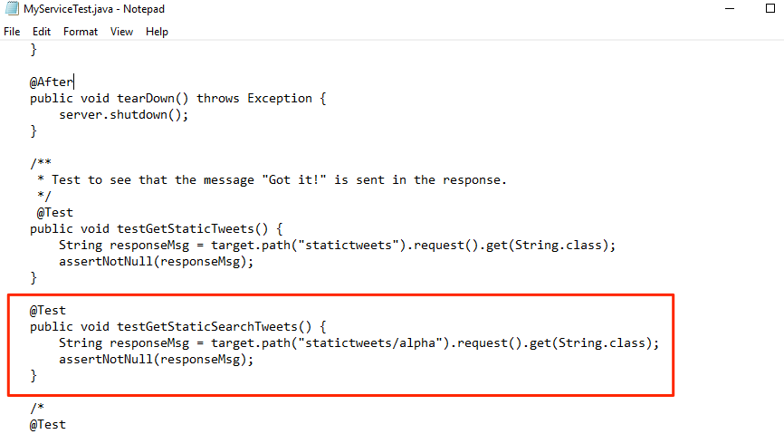  


- Execute the commands below. The **git status** will show the files that you modified in this branch. The **git config** commands will set the username and email used when pushing the changes to the Developer Cloud Service GIT repository. The finally, the **git commit** command commit the changes and add a comment.

    ```
    git status
    git config --global user.email "youremail@me.com"
    git config --global user.name "your name"
    git commit -am "Feature2: Added Support for Filtering"
    ```

    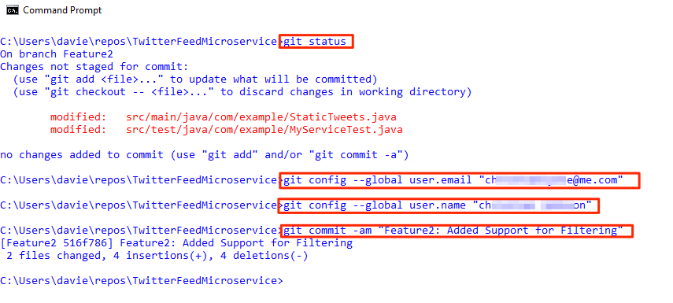

- Let's now push the code to the Repository. Execute the following command which will push the **Feature2** branch.

    ```
    git push --set-upstream origin Feature2
    ```

    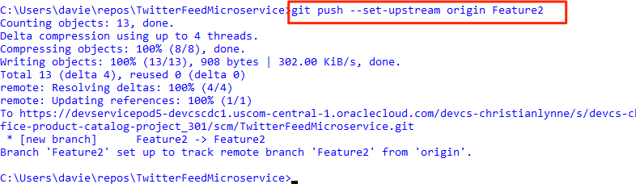

### **STEP 11**: Create Merge Request

- Return to the Developer Cloud Service Dashboard in the browser.  If the session has timed out you may have to navigate to it again. On navigation panel click **Code**, select the **Feature2** branch. Notice the changes. Click on the **Src** folder to view the changes commited to the branch from Eclipse.

    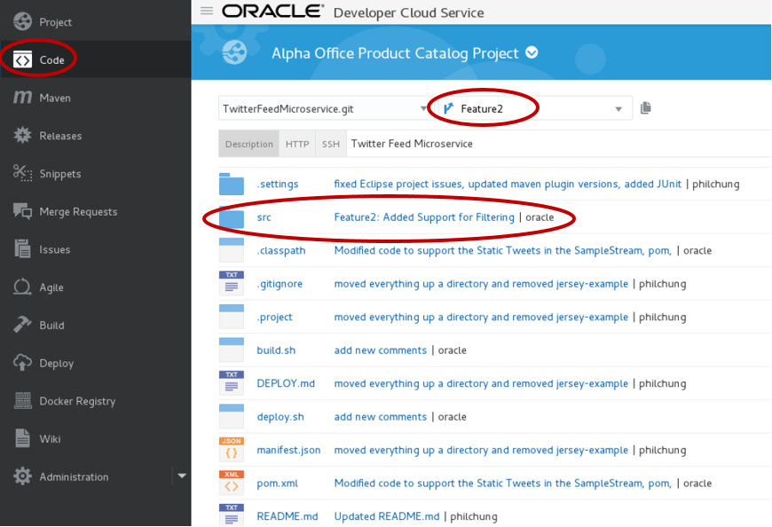  

- Click **Logs** to view latest commit.  Click commit link on left hand side to view code changes.

    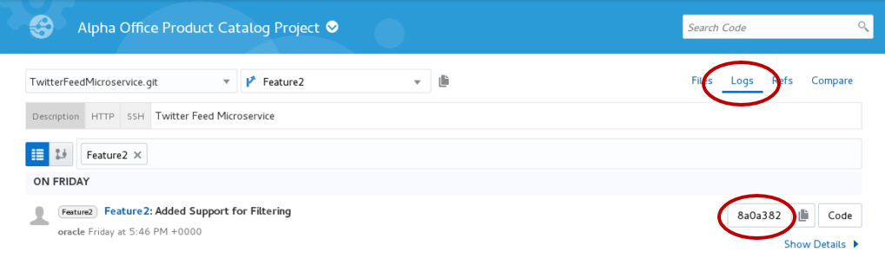  
    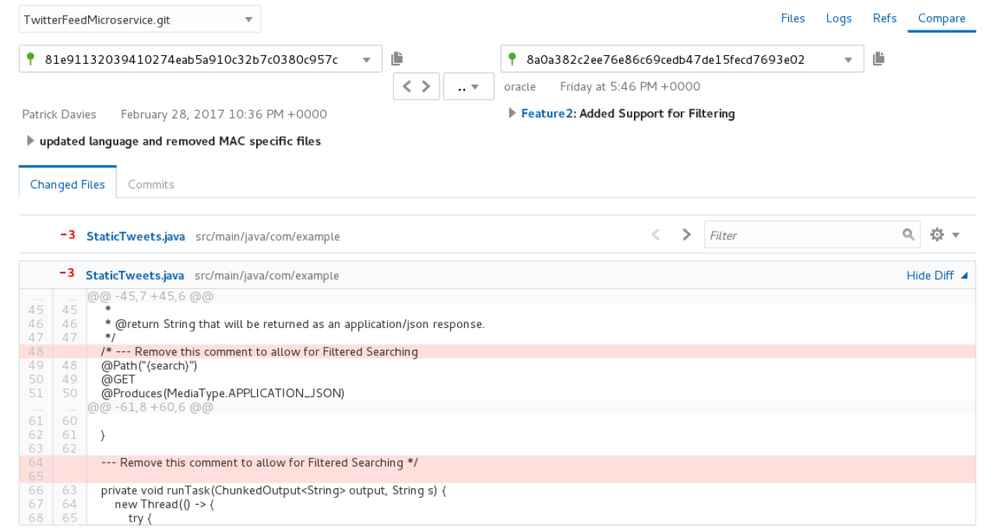  


- Now that "Bala Gupta" has completed the task of adding the search filter, a **Merge Request** can be created by Bala and assigned to Lisa Jones. 

- Click on **Merge Requests** on navigation panel and then click on the **New Merge Request** button.

      

- Enter the following information into the **New Merge Request** and click **Next**

  **Repository:** 	`TwitterFeedMicroservice.git`

  **Target Branch:** `master`

  **Review Branch:** `Feature2`

      

- Enter the following information into **Details** and click **Create**

  **Summary:** `Merge Feature 2 into master`

  **Reviewers:** `<Your Username>`

      

    **Note**: **Bala Gupta** is logically sending this request to **Lisa Jones**

## Merge the Branch and test as Lisa Jones

### **STEP 12**: Merge Requests

In the following steps “Lisa” will merge the branch create by “Bala” into the master.

  

- On navigation panel click **Merge Requests**. Select the **Assigned to Me** search. After the search completes, click on the **Merge Feature 2 into master** assigned request.

    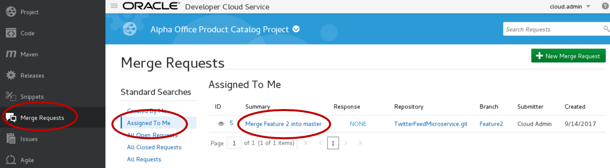  

- Once the request has loaded, select the **Changed Files** tab. “Lisa” will now have the opportunity to review the changes in the branch, make comments, request more information, etc. before Approving, Rejecting or Merging the Branch.

      

- Click on the **Merge** button.

      

- Leave the defaults, and click on the **Create a Merge Commit** button in the confirmation dialog.

    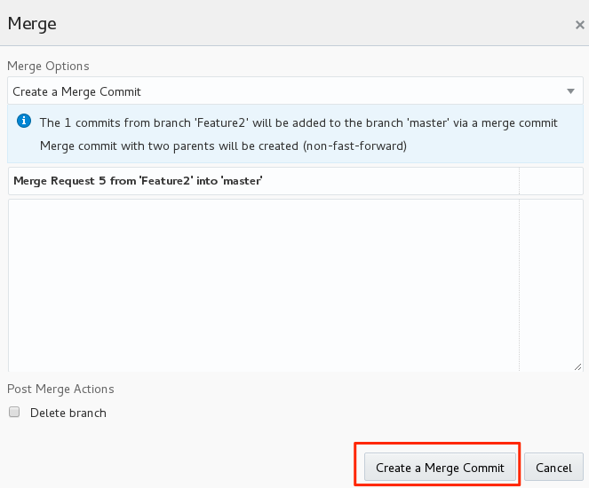  

- Now that the code has been committed to the Developer Cloud Service repository, the build and deployment will automatically start. On the navigation panel click **Build**, and you should see a **Twitter Feed Build** in the Queue

    

- Wait a minute or two for the build to start and to complete. The **Last Success** will be set to **Just Now** when the build completes.

    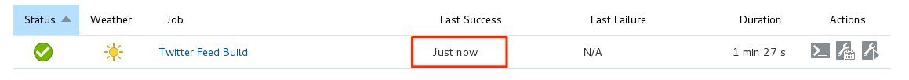

### **STEP 13**: Test the JavaTwitterMicroservice

- Click **Deploy** in the left-hand menu to load the **Deployments** screen.

- Once the Deploy completes Successfully, click on the **JavaTwitterMicroservice** link

    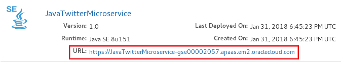  

- When the new browser tab loads, Append **/statictweets** to the end of the URL and **press enter** to test the original static twitter service. Note, if your browser  shows the JSON in a raw format, you can install a JSON formatter extension, if you desire the formatting to appear as below.

      

- Now appended `/statictweets/%23Expo` to the end of the URL and **press enter**. This will cause records containing **#Expo** in the tweet’s text or hashtags to be returned. This is how our Product Catalog will retrieve tweet's associated to a product.

      

- To complete the Sprint Feature, click **Agile** on left hand navigation. Then click on the **Active Sprints** button.

    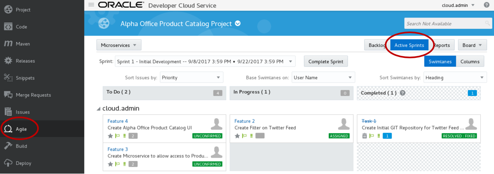  

- Complete the feature request by Dragging and Dropping **Feature 2** (Create Filter on Twitter Feed) from the **In Progress** to the **Completed** Column.

    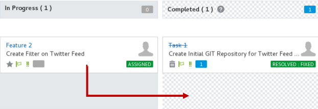  

- Leave defaults and click **Next**.

    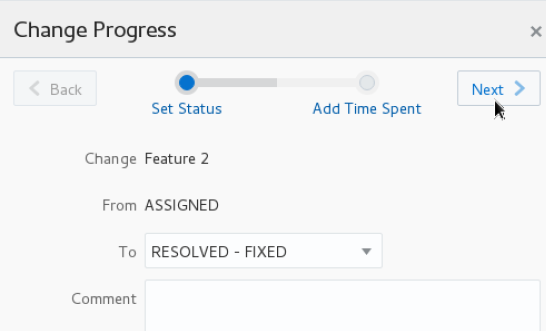  

- Set the **Time Spent** to `1` and click on **OK**.

      

- **You are now done with this lab.**
