# Cloud Native Rapid JavaScript Development with node.js


Updated: Dec 7, 2017

## Introduction

This is the fourth of several labs that are part of the **Oracle Cloud DevOps: Cloud Native Microservices Workshop.** This workshop will walk you through the Software Development Lifecycle (SDLC) for a Cloud Native project that will create and use several microservices.

In the first lab (100), the Project Manager created a new project in the Developer Cloud Service and also created and assigned tasks to the developers of this application. In the second lab (200), the Java developer created a new microservice to retrieve and filter Twitter data. In the third lab (300), the full stack developer created a microservice to extract data from a database. In this lab (400), you will assume the persona of the UI developer who will create a new generation product catalog UI that consumes REST services. This product catalog UI will combine both the Twitter Feed Microservice and the Product Catalog Microservice into a single unified view for the user.

**To log issues**, click here to go to the [github oracle](https://github.com/oracle/learning-library/issues/new) repository issue submission form.

## Objectives

- Access Developer Cloud Service
- Import code from an external Git repository
- Import a project into Brackets
- Build and deploy a project using Developer Cloud Service and Oracle Application Container Cloud Service

## Required Artifacts

- The following lab requires an Oracle Public Cloud account that will be supplied by your instructor. You will need to download and install the latest version of Brackets or use a supplied compute VM. Instructions are found in the Student Guide.

# Create A New Generation Product Catalog UI

## Explore Developer Cloud Service

### **STEP 1**: Review Agile Board

- This Lab assumes that you just completed Lab 300 and are still connected to the Oracle Cloud, that you're still in the Developer Cloud Service Console, and you're viewing the "Alpha Office Product Catalog Project." If for some reason that is not the case, follow the first several Steps of Lab 100 to once again view the Developer Cloud Service Console.

- Although you will remain connected to the Oracle Cloud using the user account you were provided, you will take on the Persona of ***John Dunbar*** as you perform the following steps.

      

- Within the **Alpha Office Product Catalog Project**, click on **Agile** found on the left hand navigation.

      

### **STEP 2**: Display the Active Sprint

- On the **Microservices** Board, click **Active Sprints**.

      

## Create Initial Git Repository

### **STEP 3**: Create Initial Git Repository

To begin development on our Product Catalog UI, we could start coding from scratch. However, prior to the formal kickoff of this project, you (as John Dunbar) have already started doing some proof-of-concept development outside of the Developer Cloud Service in order to assess the feasibility of your assignment. You want to bring that existing code into the Developer Cloud Service as a starting point for your UI. You will do that by cloning your external GIT repository into the Developer Cloud Service. Your first step will be to accept your task using the agile board.

- Drag and drop **Feature 4 - Create Alpha Office Product Catalog UI** into the **In Progress** swim-lane.  

      

- Leave the defaults, and Click **OK**.

      

- Your Sprint progress will appear as shown below:

      

- In the left hand navigation panel, click **Project**.

- Click **New Repository**. In the New Repository wizard enter the following information and click **Create**.

    **Name:** `AlphaOfficeProductCatalogUI`

    **Description:** `Alpha Office Product Catalog UI`

    **Initial content:** `Import existing repository`

    **Enter the URL:** `https://github.com/pcdavies/ProductCatalogUI.git`

    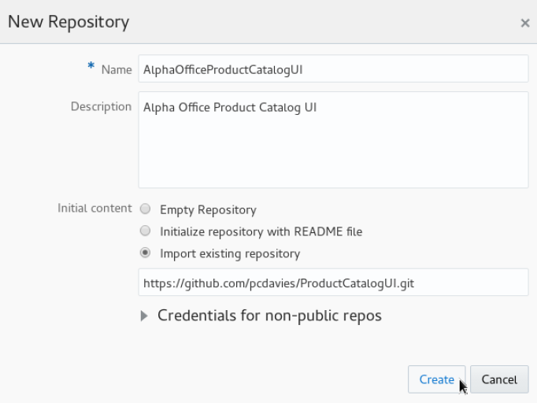  

- You have now created a new GIT repository stored within the Developer Cloud Services that is based on an existing repository.

      

## Create Default Build and Deployment Process

### **STEP 4**: Create Default Build Process

Now that we have the source code in our managed GIT repository, we need to create a build process that will be triggered whenever a commit is made to the master branch. We will use NPM Package Manager to set up a Node.js build process in this section.

- On the left side navigation panel click **Build** to access the build page.

- Click **New Job**.

- In the New Job popup enter `Product Catalog UI Build` for the Job Name, and then click **Save**.

    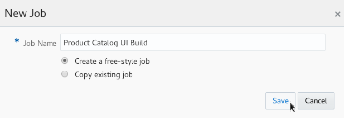  

- You are now placed into the job configuration screen.

    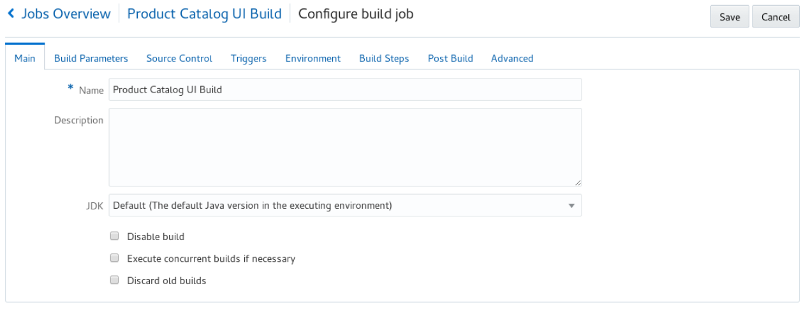  

- Click the **Source Control** tab. Click **Git** and select the **AlphaOfficeMyProductCatalogUI.git** from the drop down.

    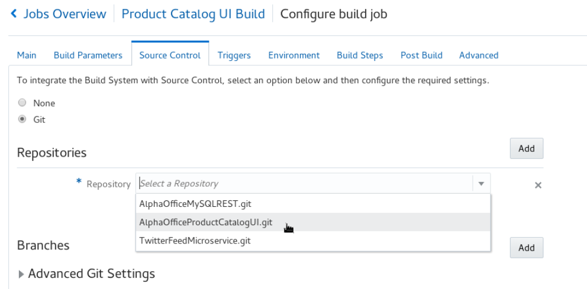  

- Click the **Triggers** tab.

  **Select**: `Based on SCM polling schedule`.

    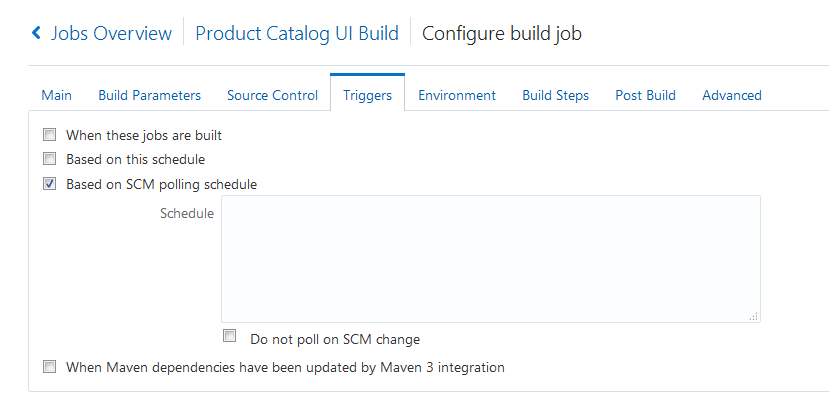  

- Click the **Build Steps** tab. Click **Add Build Step**, and select **Execute shell**.

    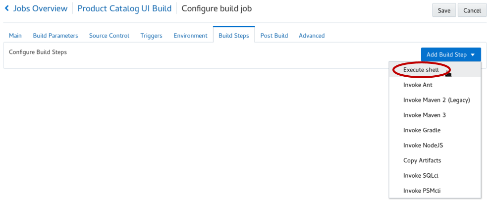  

- For **Command** enter: `npm install`

    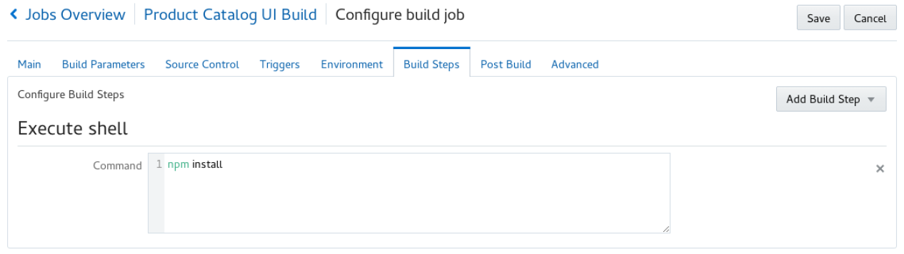  

- Click the **Post Build** tab and complete the following:
  - Check **Archive the artifacts**.
  - Enter `**/target/*` for **Files to Archive**.  
  - Verify **GZIP** in the Compression Type.
  
    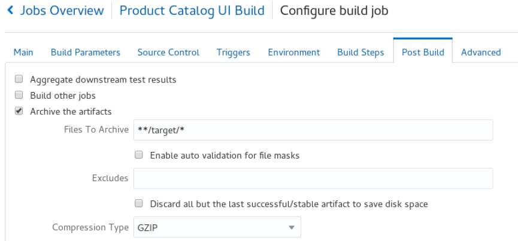  

- Click **Save** to complete the configuration.

- Click the **Build Now** button to start the build immediately. 

      

- Wait, as it may take up to a few minutes for the queued job to execute, but when it does, the status will change to the following:

      

  **NOTE:** Once the build begins, it should take approximately 1 to 2 minutes for the build to complete. Once complete, you will be able to see the number of successful test runs in the Test Result Trend section. ***Wait for the build to complete before continuing to the next step***, as we need the build artifact to complete the deployment configuration.

- After the build begins, you can also click on the **Console Icon** to monitor the build log details.  

- The completed status will look as follows:

    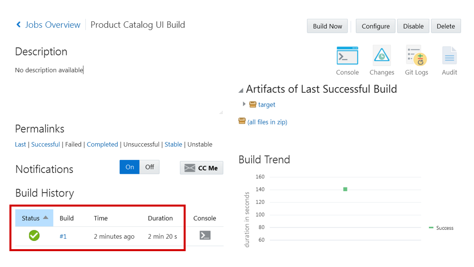  

### **STEP 5**: Create Default Deployment Process

Now that we have an automated build process, we will set up a deployment configuration that will push out build artifacts to a node.js environment running on Application Container Cloud Service. This will happen whenever a successful build occurs.

- On the navigation panel click **Deploy** to access the Deployment page. Click **New Configuration**.

- Enter the following data:

  **Configuration Name**: `DeployProductCatalogUI`

  **Application Name**: `AlphaOfficeProductCatalogUI`

    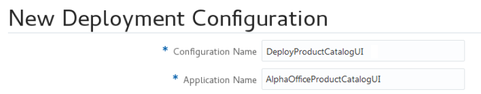  

- Click on the **Deployment Target** drop down and select the deployment defined in lab 200.

    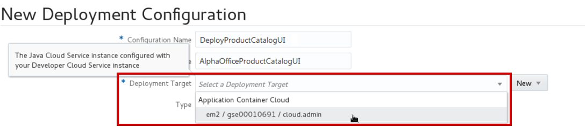  

- In the Deployment window, click **Test Connection**. If Successful, click **Use Connection**:

      

- Set the following Properties:

  - **Runtime**: `Node`

  - **Subscription**: `Hourly`

  - **Type:** `Automatic` and `Deploy stable builds only`

  - **Job:** `Product Catalog UI Build`

  - **Artifact:** `target/msdbw-microserviceui.zip`

    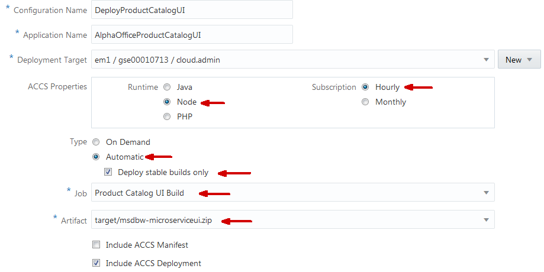  

- To reduce the number of resources that are used, we will modify the default deployment of 2 instances. Click **Include ACCS Deployment** and enter the following in the text box:

```
{
  "memory": "1G",
  "instances": "1"
}  
```
- The bottom of the page will look like this:

  

- Click **Save**.

    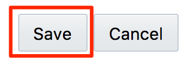 

- A message shows the deployment has been created.

     

- Click the gear drop down for **AlphaOfficeProductCatalogUI** and select **Start**.

      

- Wait until the message **Starting application** changes to **Last deployment succeeded**.

      

      

## Verify Product Catalog UI deployment

### **STEP 6**: Test Product Catalog UI

- We are able to access the application directly from Developer Cloud Service. Click **AlphaOfficeProductCatalogUI** to launch the application.

      

- A new tab in the browser should open with the UI application running.

    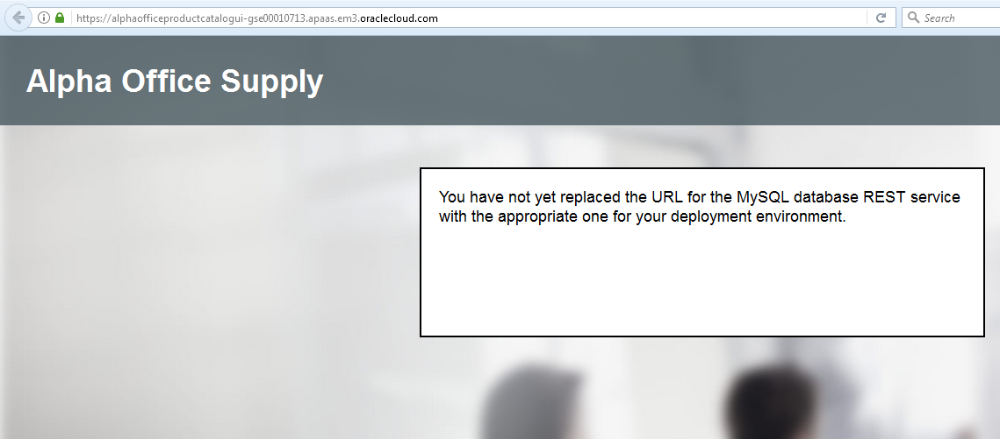  

- The UI application is running, but REST services have not been activated.

# Add Microservice endpoints

Now that we have our default application, we want to modify this application to use the deployed microservices from Labs 200 and 300. For this task we will use the Brackets text editor to download code from Developer Cloud Service and make our modifications. Once the edited code is ready for deployment, we will push the edited code to the master branch in the Developer Cloud Service which will trigger a new build and deployment.

**Note:** Normally in a real-life scenario, you would create a Git branch, make all the changes documented in this section of the lab, commit those changes to the branch and then create a merge request. However, for the sake of time, and since the branch and merge concepts have already been covered, we will bypass best practices and make changes directly to the master branch.

## Clone Project to the Brackets Text Editor

### **STEP 7**:	Start the Brackets Text Editor

- Start the **Brackets** text editor. How you start Brackets will depend on your OS. We have documented how to start Brackets from our OEL image. ***Note***: If you do not have Brackets installed, please follow the **Student Guide** that is part of this workshop. You will find instruction on how to install Git, configure Brackets and start Brackets.

- Right click the **Brackets** desktop icon and select **Open**.

    

- Brackets should open with the **ProductCatalogUI** folder already loaded.

    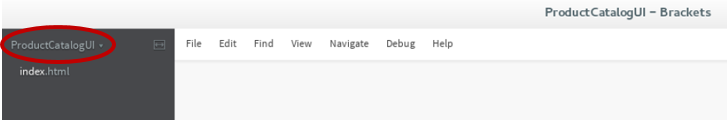  

### **STEP 8**: Copy GIT URL

- Back in Developer Cloud Service, click on **Project**. On the right side, find the URL for **AlphaOfficeProductCatalogUI.git**. Select the URL, right click and select **Copy** from the drop down menu.

    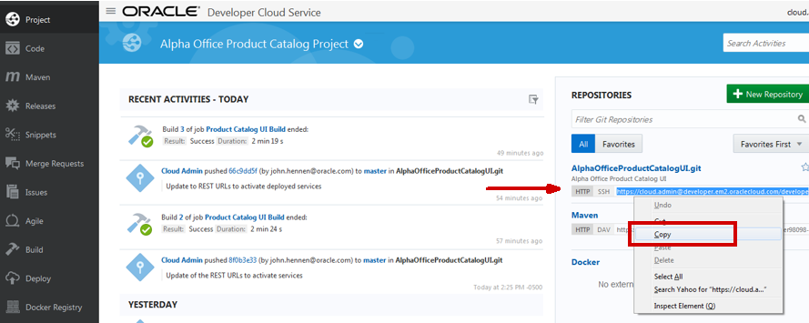  

### **STEP 9**: Clone GIT Repository

- Back in the Brackets editor, Click on the **Git** icon found on the right side of the editor. 

    

- Click **Clone**.

    

- Paste the Git URL that you captured from Developer Cloud Service into the Git URL field. **Username** should be populated automatically. Enter your **Password** and click **Save credentials**. Once completed, click **OK** to start the cloning process.

    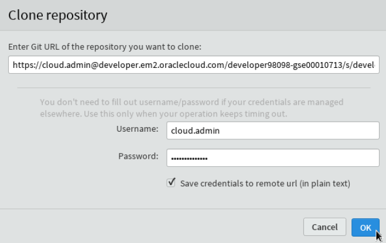  

- While the clone is running, a dialog box will show you the progress.

      

- You now have a local copy of the repository.

    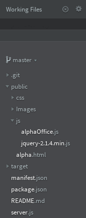

### **STEP 10**: Edit the UI Code

- Now go back to Developer Cloud Service to obtain the URLs for the two microservices created in Labs 200 and 300.  Click on **Deploy** in the console, and then right click on the name **AlphaOfficeREST** to copy the URL for the microservice. Save this URL, as you will use it later. 

    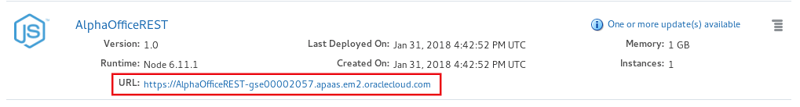

- Right click on the name **JavaTwitterMicroservice** to copy the URL for this microservice. Save this URL, as you will use it later. 

    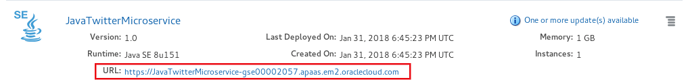

- In Brackets, choose the **public/js/alphaOffice.js** file to edit. Ignore and close any Lint warnings that might appear.

    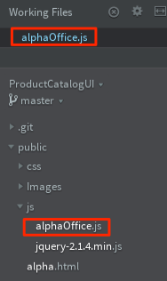


- You will be putting the URLs of the two microservices into the code in order to access these services.  Paste the URL for the **AlphaOfficeREST** microservice as the value for the Javascript variable **dbServiceURL**. ***Note:*** You must append **/products** to the end of the URL you coppied and pasted. 

    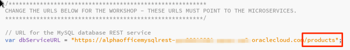


- Paste the URL for the **JavaTwitterMicroservice** microservice as the value for the Javascript variable **twitterServiceBaseURL**. ***Note:*** You must append **/statictweets** to the end of the URL you coppied and pasted.

    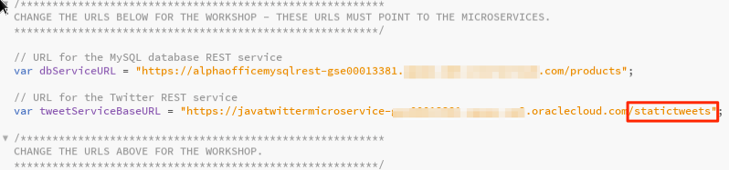

- The modified alphaOffice.js file should appear as follows

    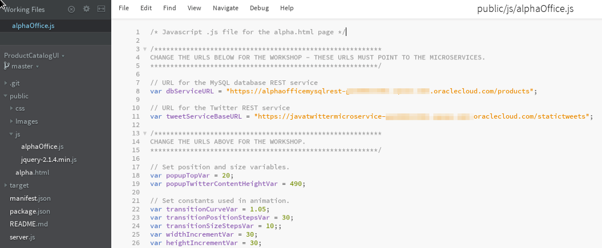

- Choose **Save** from the Brackets **File** menu.

    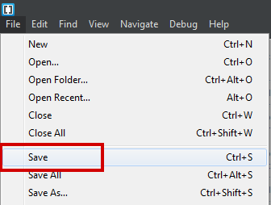

### **STEP 11**: Push the Edited Code Back to the Developer Cloud Service

- In the Git portion of the screen, Click the checkbox to the left of the row for **Staged, Modified public/js/alphaOffice.js**.

- Then click **Commit**. 

    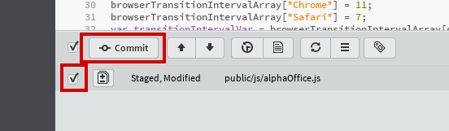

- Note: there are a number of formatting and other non-fatal warnings that will be reported for the alphaOffice.js file. Ignore these.

- Enter the following **Commit** message and then click **OK**: `Update to REST URLs to activate deployed services`

    

- You may need to enter a Git username. (Enter your username for your cloud service.) And you may need to enter an email address. (Any will do.) Finally, click **OK**.

    

- The page now shows there is nothing to commit, and the working directory is clean. Click on the Git **Push** icon. **Note:** If the number (1) is not showing next to Push Icon as shown below, you will need to repeat the commit steps.

    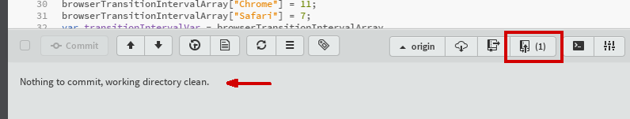

- Enter the cloud **username** and **password** that you were given. Make sure **Save credentials** to remote url (in plain text) is checked. Finally, click **OK**.

    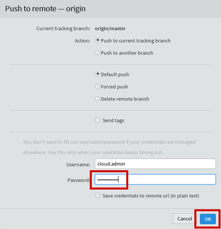

- The edited code within the local Git repository has been successfully pushed to the master branch of the repository in the Oracle Developer Cloud Service.

    

- Go to the Cloud Developer Service console.  Click on **Code** and on the **Refs** tab. Note the recently pushed update with the commit message text you just entered. Click **Master** to view the changes commited to the master branch.

    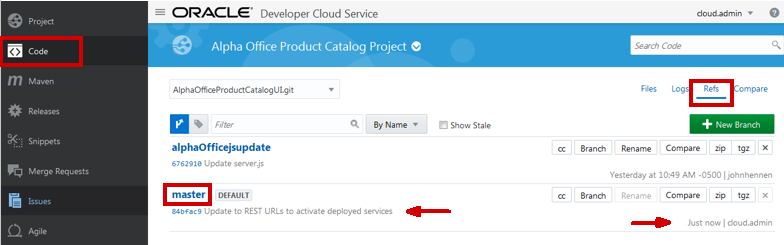

- Click the **Files** tab, then the **public** folder, followed by the **js** folder, and then and note the recent timestamp for the **alphaOffice.js** file.

    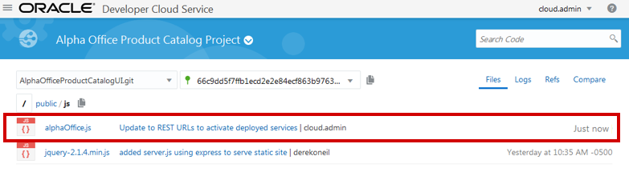

### **STEP 12**: Test Product Catalog UI with Edited Code

- Return to the Developer Cloud Service, and click on the **Build** menu option. 

    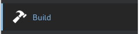

- Wait for the build for the **Product Catalog UI** to complete.

    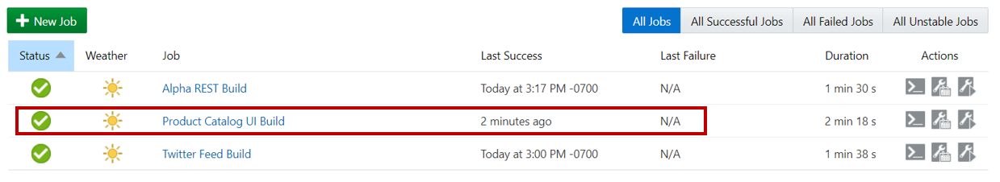

- Click on the **Deploy** Developer Cloud Services option, and wait for a current Deployment of the **AlphaOfficeProductCatalogUI** to start and then complete. Note: Sometimes you may need to refresh the screen to see the timestamp update.

    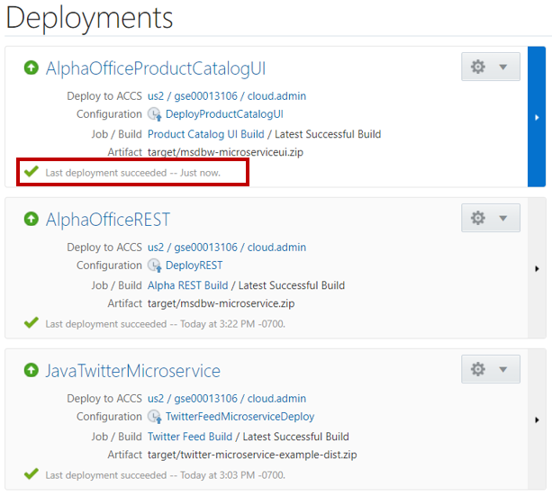

- Once the new UI has successfully deployed, Click on the **AlphaOfficeProductCatalogUI** link to open the Application that now accesses the Data using the REST API.

   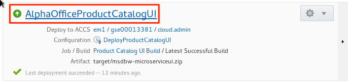

- The REST services have now been activated, and the UI application is fully functional.

   

- Click on any **product** to display the Tweets associated with that product. The Tweets are also accessed using a REST API.

   

- After viewing the tweets, click on the **Close** button.

   

### **STEP 13**: Complete Task

We have now verified that the Product Catalog UI has been deployed and functions properly. To complete this lab, we will mark the Issue as completed in the Sprint.

- Back in the Developer Cloud Service window, click **Agile**, followed by clicking **Active Sprints**.

- Drag and drop **Feature 4** from **In Progress** to **Completed**.

      


- In the Change Progress popup click **Next**.

      

- In the **Add Time Spent** popup, set the **Time Spent** to `1` and click **OK**.

      

- Your Sprint should now look like the following:

     

- **You are now done with this lab.**
