# Cloud Native Rapid JavaScript Development with node.js

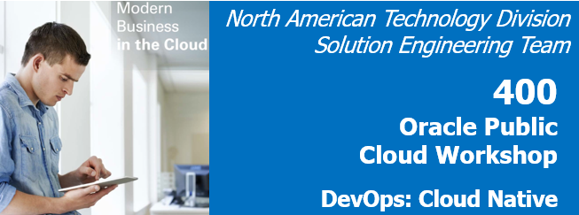

Updated: April 17, 2018

## Introduction

This is the fourth of several labs that are part of the **Oracle Cloud DevOps: Cloud Native Microservices Workshop.** This workshop will walk you through the Software Development Lifecycle (SDLC) for a Cloud Native project that will create and use several microservices.

In the first lab (100), the Project Manager created a new project in the Developer Cloud Service and also created and assigned tasks to the developers of this application. In the second lab (200), the Java developer created a new microservice to retrieve and filter Twitter data. In the third lab (300), the full stack developer created a microservice to extract data from a database. In this lab (400), you will assume the persona of the UI developer who will create a new generation product catalog UI that consumes REST services. This product catalog UI will combine both the Twitter Feed Microservice and the Product Catalog Microservice into a single unified view for the user.

**To log issues**, click here to go to the [github oracle](https://github.com/oracle/learning-library/issues/new) repository issue submission form.

## Objectives

- Access Developer Cloud Service
- Import code from an external Git repository
- Build and deploy a project using Developer Cloud Service and Oracle Application Container Cloud Service
- Create a Build Pipeline

## Required Artifacts

- The following lab requires an Oracle Public Cloud account that will be supplied by your instructor. 

# Create A New Generation Product Catalog UI

## Explore Developer Cloud Service

### **STEP 1**: Review Agile Board

- This Lab assumes that you just completed Lab 300 and are still connected to the Oracle Cloud, that you're still in the Developer Cloud Service Console, and you're viewing the "Alpha Office Product Catalog Project." If for some reason that is not the case, follow the first several Steps of Lab 100 to once again view the Developer Cloud Service Console.

- Although you will remain connected to the Oracle Cloud using the user account you were provided, you will take on the Persona of ***John Dunbar*** as you perform the following steps.

      

- Within the **Alpha Office Product Catalog Project**, click on **Agile** found on the left hand navigation.

      

### **STEP 2**: Display the Active Sprint

- On the **Microservices** Board, click **Active Sprints**.

    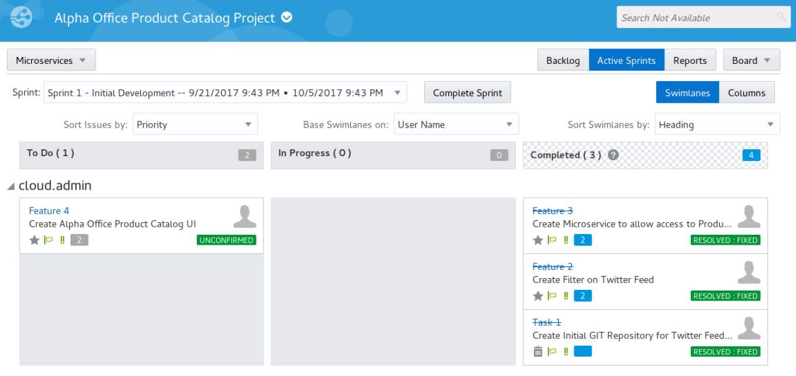  

## Create Initial Git Repository

### **STEP 3**: Create Initial Git Repository

To begin development on our Product Catalog UI, we could start coding from scratch. However, prior to the formal kickoff of this project, you (as John Dunbar) have already started doing some proof-of-concept development outside of the Developer Cloud Service in order to assess the feasibility of your assignment. You want to bring that existing code into the Developer Cloud Service as a starting point for your UI. You will do that by cloning your external GIT repository into the Developer Cloud Service. Your first step will be to accept your task using the agile board.

- Drag and drop **Feature 4 - Create Alpha Office Product Catalog UI** into the **In Progress** swim-lane.  

    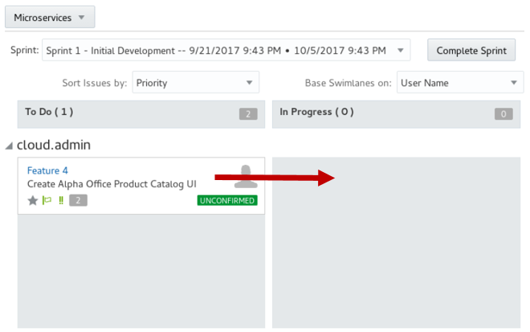  

- Leave the defaults, and Click **OK**.

    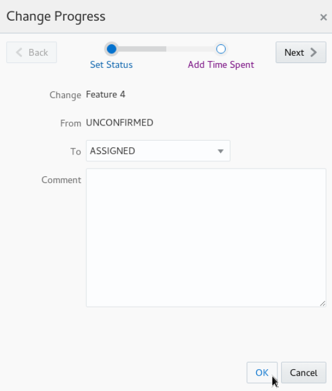  

- Your Sprint progress will appear as shown below:

    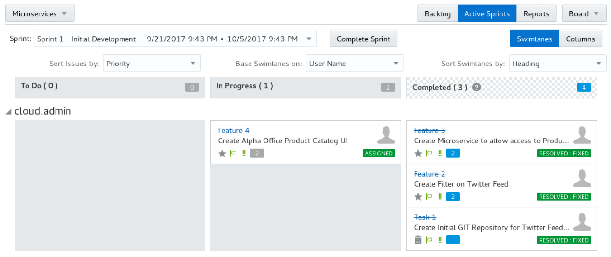  

- In the left hand navigation panel, click **Project**.

- Click **New Repository**. In the New Repository wizard enter the following information and click **Create**.

    **Name:** `AlphaOfficeCatalogUI`

    **Description:** `Alpha Office Catalog UI`

    **Initial content:** `Import existing repository`

    **Enter the URL:** `https://github.com/pcdavies/ProductCatalogV2UI.git`

    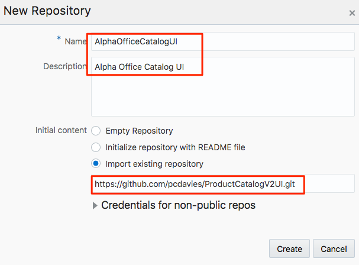  

- You have now created a new GIT repository stored within the Developer Cloud Services that is based on an existing repository.

    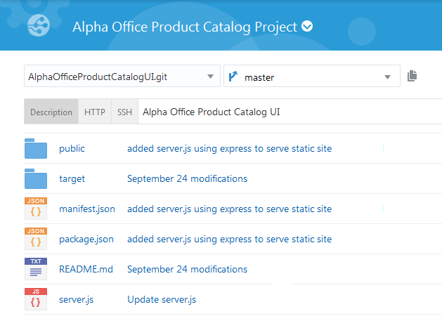  

## Create Default Build and Deployment Process

### **STEP 4**: Create Default Build Process

Now that we have the source code in our managed GIT repository, we need to create a build process that will be triggered whenever a commit is made to the master branch. We will use NPM Package Manager to set up a Node.js build process in this section.

- On the left side navigation panel click **Build** to access the build page.

- Click **New Job**.

- In the New Job popup enter `ProductCatalogUIBuild` for the Job Name, and then click **Create Job**.

    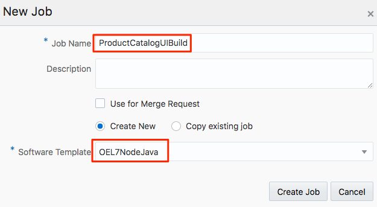  

- You are now placed into the job configuration screen. Click on **Add Source Control** and select **Git**.

    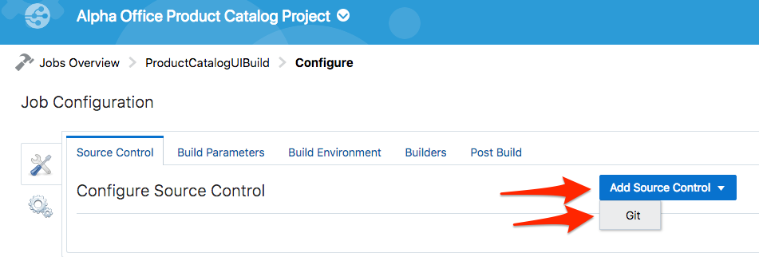  

- Click on the **Repository** dropdown and select **AlphaOfficeCatalogUI.git**. Select the **Automatically perform build on SCM commit** option. 

    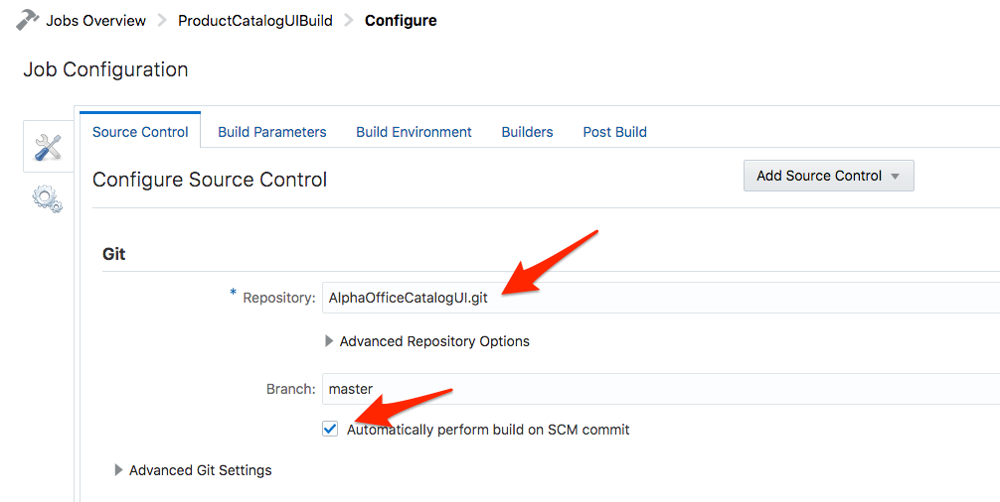  

- Click on the **Builders** table, then click on **Add Builder** and select **Unix Shell Builder**

    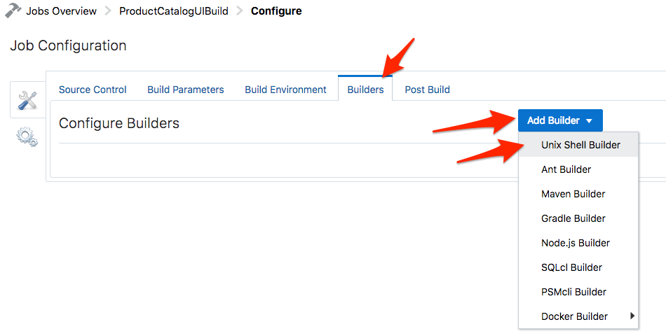  

- In the **Script** field enter: 

    ```
    npm install
    ```

    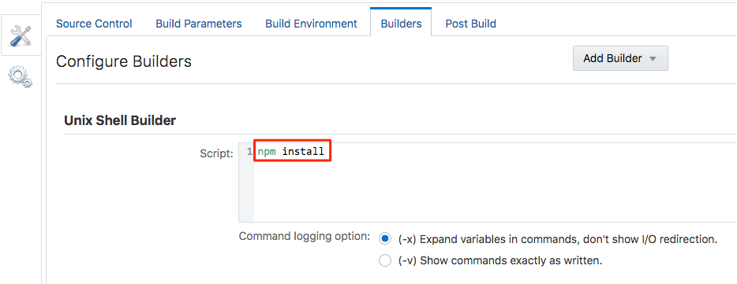  

- Click on the **Post Build** tab and select **Artifact Archiver**.

    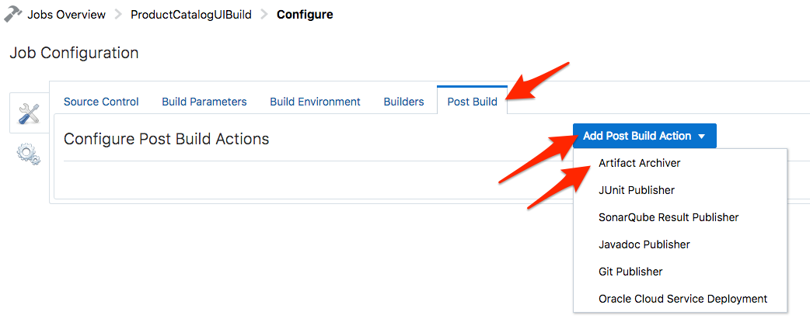  

    **Files to Archive**: `**/target/*`

    Check **Archive Maven Artifacts**

    **Compression**: Verify **GZIP** in the Compression Type.

    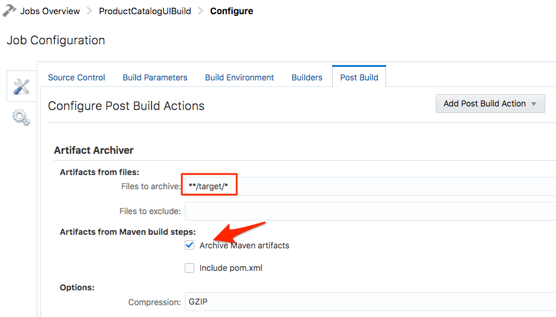  

- Click **Save** to complete the configuration.

- Click the **Build Now** button to start the build immediately. 

    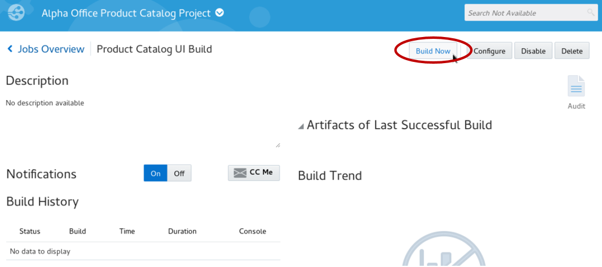  

- Wait, as it may take up to a few minutes for the queued job to execute, but when it does, the status will change to the following:

    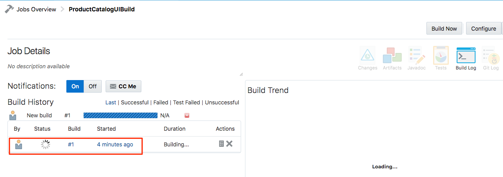  

  **NOTE:** Once the build begins, it should take approximately 1 to 2 minutes for the build to complete. Once complete, you will be able to see the number of successful test runs in the Test Result Trend section. ***Wait for the build to complete before continuing to the next step***, as we need the build artifact to complete the deployment configuration.

- After the build begins, you can also click on the **Build Log** to monitor the build log details. 

    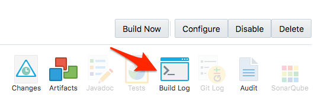  

- The completed status will look as follows:

    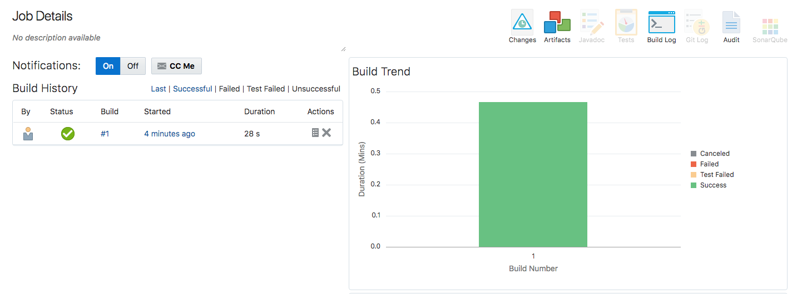  

### **STEP 5**: Create Default Deployment Process

Now that we have an automated build process, we will set up a deployment configuration that will push out build artifacts to a node.js environment running on Application Container Cloud Service. This will happen whenever a successful build occurs.

- Before we create the new deployment, you will need the URLs for the two Services you previously created, as we will pass those URLs into this new services. To capture those URLs, click on the **Deploy** menu option on the left side of the screen. Then **Right Click** on the **AlphaOfficeREST** deployment, and **Copy the Link**. **Save** the link, and it will be used shortly.

    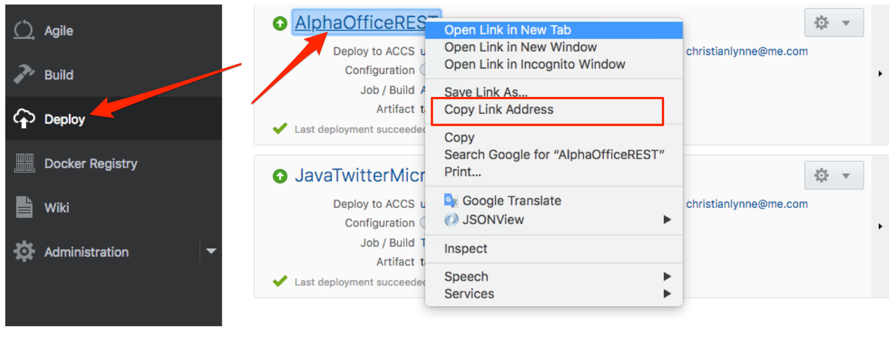  
 
- Next, **Right Click** on the **JavaTwitterMicroservice**, and **Copy the Link**. Also **Save** that link, as it will also be used shortly.

    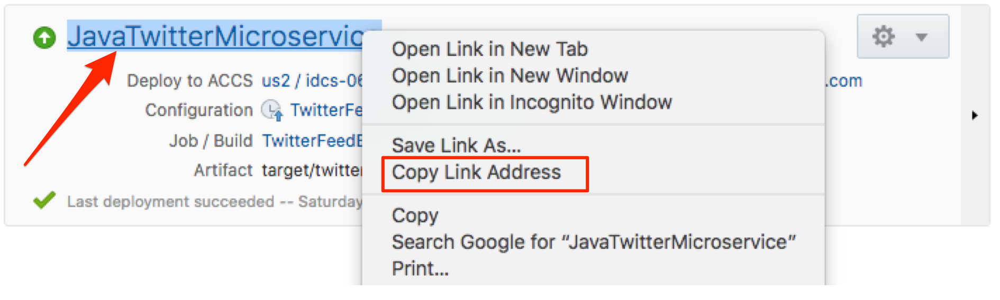  

- We're now ready to create the next deployment. Click **New Configuration**.

- Enter the following data:

  **Configuration Name**: `DeployProductCatalogUI`

  **Application Name**: `AlphaOfficeProductCatalogUI`

  **Deployment Target**: Select the Deployment Target you previously created

- Enter your account **Password** and after testing the connection, click on **Use Connection**

    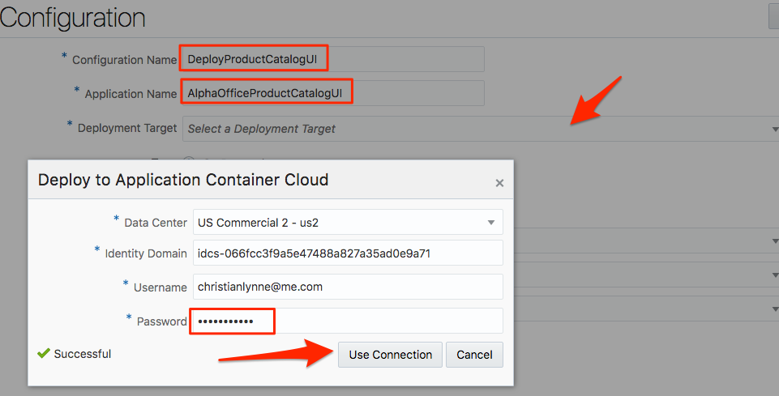  

- Set the following Properties:

    - **Runtime**: `Node`

    - **Subscription**: `Hourly`

    - **Type:** `Automatic` and `Deploy stable builds only`

    - **Job:** `ProductCatalogUIBuild`

    - **Artifact:** `target/msdbw-microserviceui.zip`

    - To reduce the number of resources that are used, we will modify the default deployment of 2 instances. Click **Include ACCS Deployment** and enter the following in the text box. 
    - ***Note: You must paste the two URLs you copied into the create environment variable place holders***: Passing in these URLs will allow the UI to access the REST services providing the Product Catalog and Twitter Feed data.

    ```
    {
        "memory": "1G",
        "instances": "1",
        "environment": {
            "DB_REST_URL": "REPLACE WITH THE AlphaOfficeREST URL",
            "TWITTER_URL": "REPLACE WITH THE JavaTwitterMicroservice URL"
        }
    }  
    ```
    - After your screen appears as shown below, click on **Save**

    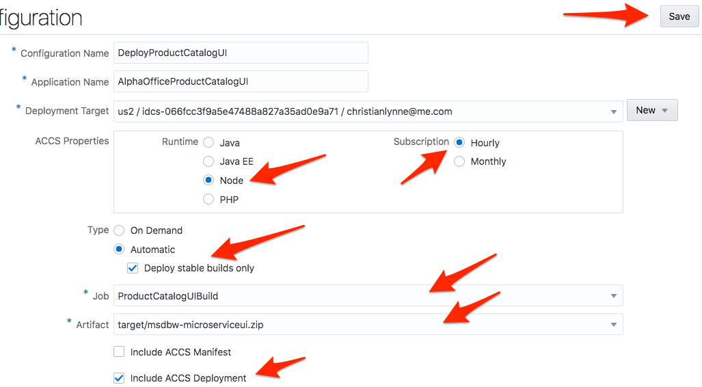  

    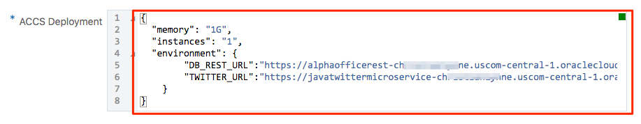

- A message shows the deployment has been created.

    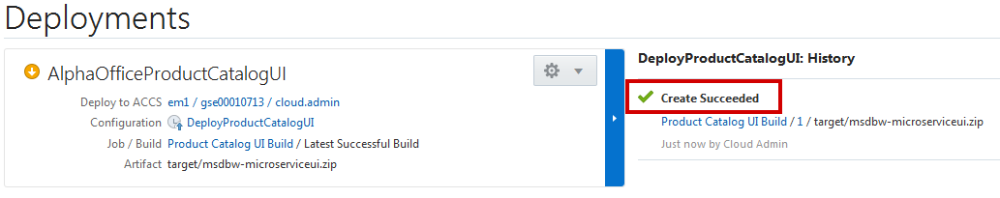 

- Click the gear drop down for **AlphaOfficeProductCatalogUI** and select **Start**.

    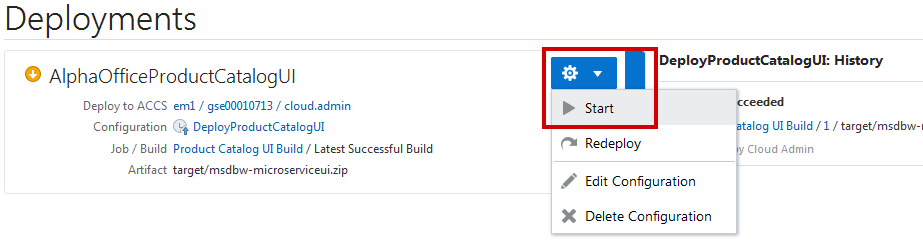

- As some background, before deploying the AlphaOfficeProductCatalogUI to the cloud, John made some modifications to support passing Environment variables into the UI. First, John modified the **./server.js** code, since server.js has access to the Environment variables using **process.env** calls. He added a new function which allows other services to access the REST endpoints for the ProductCatalog and TwitterFeed Services.

      

    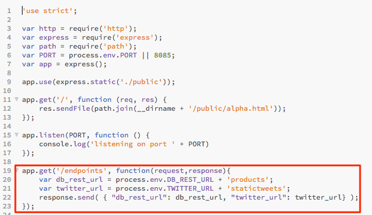  

- Next, John modified the **./public/js/alphaOffice.js** code to allow it to call the **server.js** code and acquire the REST endpoint URLs.

    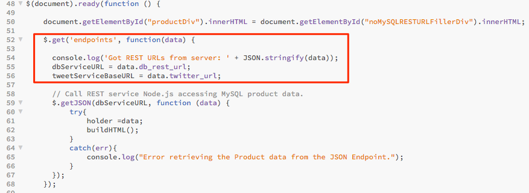

- Wait until the message **Starting application** changes to **Last deployment succeeded**.

    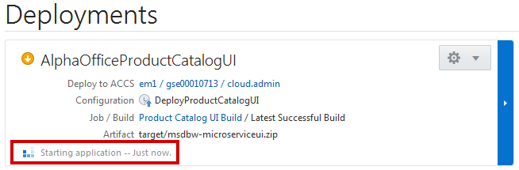  

    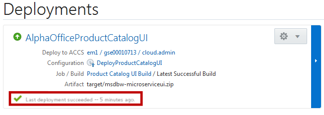  

## Verify Product Catalog UI deployment

### **STEP 6**: Test Product Catalog UI

- We are able to access the application directly from Developer Cloud Service. Click **AlphaOfficeProductCatalogUI** to launch the application.

    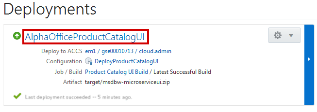  


- If the page initially loads with an error, wait a minute try refreshing the page. Once loaded, the UI is accessing the two REST services to Acquire the Product Catalog information and any Tweets associated with Product.

   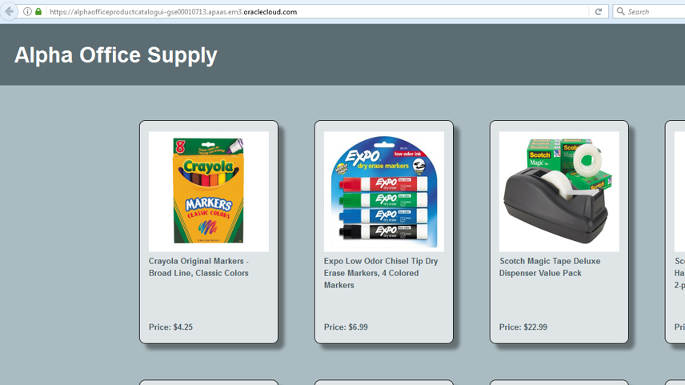

    As an overview of how the UI Application makes calls to the REST services, here is a quick review of the two code snippets from the AlphaOfficeProductCatalogUI

- Click on any **product** to display the Tweets associated with that product. The Tweets are also accessed using a REST API.

   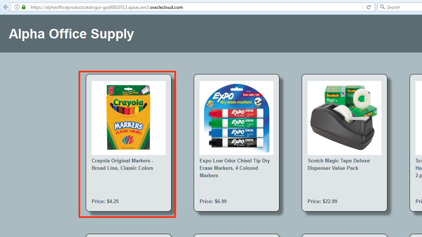

- After viewing the tweets, click on the **Close** button.

   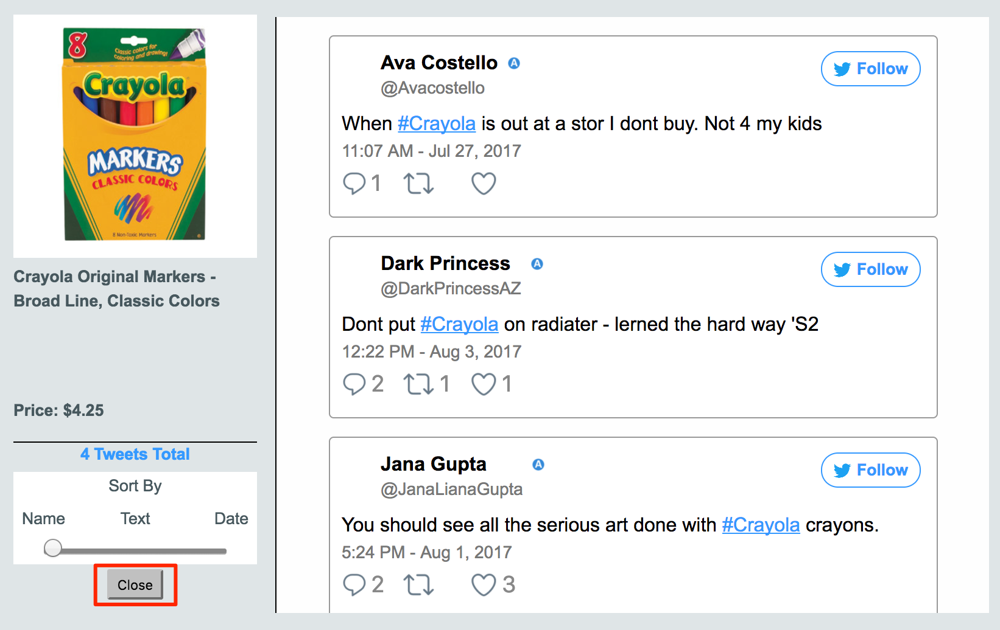

### **STEP 7**: Complete Task

We have now verified that the Product Catalog UI has been deployed and functions properly. To complete this lab, we will mark the Issue as completed in the Sprint.

- Back in the Developer Cloud Service window, click **Agile**, followed by clicking **Active Sprints**.

- Drag and drop **Feature 4** from **In Progress** to **Completed**.

    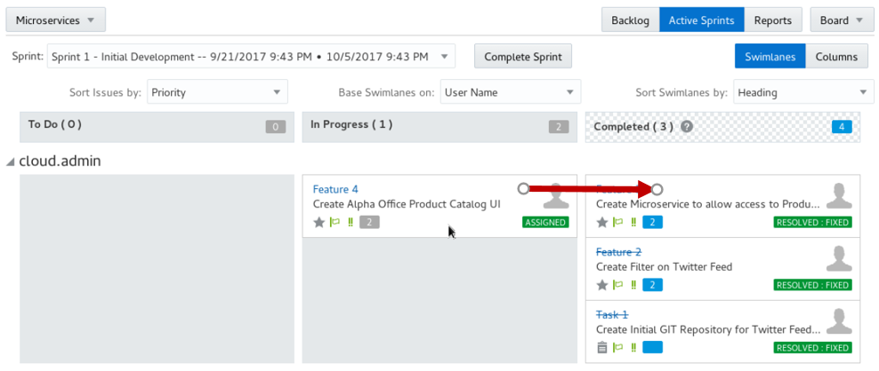  


- In the Change Progress popup click **Next**.

      

- In the **Add Time Spent** popup, set the **Time Spent** to `1` and click **OK**.

    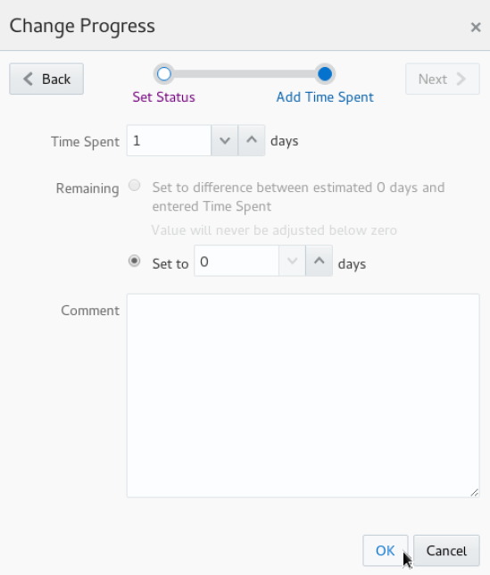  

- Your Sprint should now look like the following:

    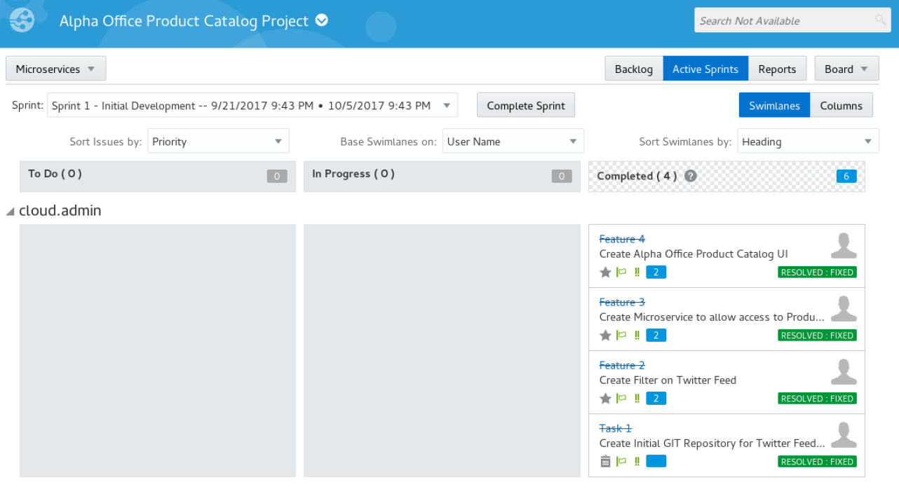 

## Create a build Pipeline

### **STEP 8**: Create Build Pipeline

Developer Cloud service provides the ability to create Build Pipelines. With a build pipeline you're able to determine which build runs when, and what other builds it will trigger.

- Click on the **Build** left hand menu option. Then click on the **Pipelines** tab in the build window.

    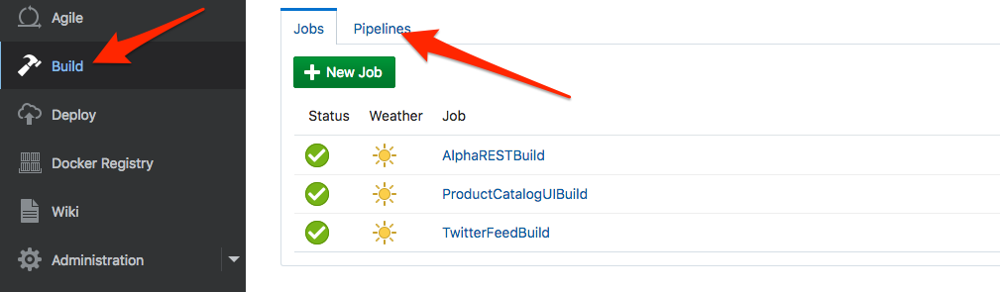 

- Click on the **New Pipeline** button

    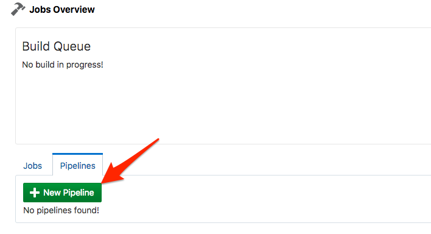 

- Enter the following in the dialog:
    - **Name:** `AlphaOfficeBuildPipeline`
    - **Auto Start...**: For the sake of this workshop, we are turning this option off. We don't want to trigger the pipeline, if you decide to build a job independently. 
    - **Disallow pipeline**: Also for the sake of this demo, we don't want any manually started build jobs to cause the pipeline to start.
    - Click on **Create** 

    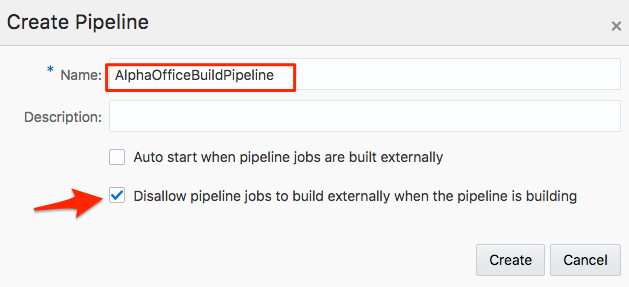 

- Drag and drop **AlphaRESTBuild, TwitterFeedBuild** and **ProductCatalogUIBuild** to the diagramming panel.

- Connect **Start** to **AlphaRESTBuild** and **TwitterFeedBuild**. Then connect **AlphaRESTBuild** and **TwitterFeedBuild** to **ProductCatalogBuild**. This will allow the ProductCatalogBuild to be run only if TwitterFeedBuild and AlphaRESTBuild complete Successfully.

    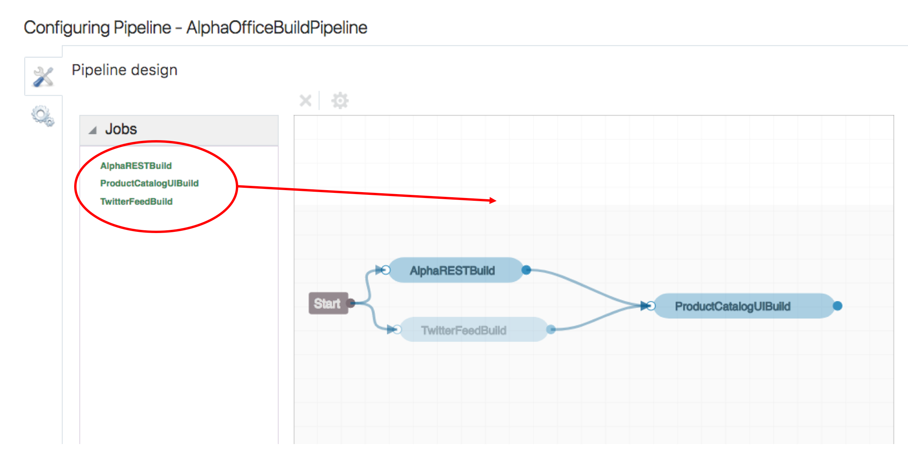 

- Click on **Save**

### **STEP 9**: Start the Build

- Click on the **Build** icon to start the build pipeline.

    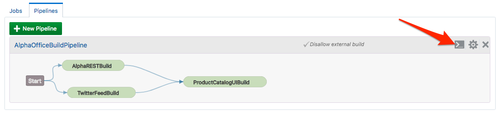 

- You can monitor the progress of the Pipeline job from the **Pipelines** tab.

    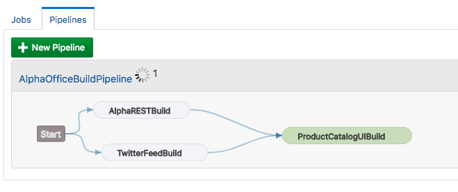 

- Or, you can monitor progress from the **Jobs** tab.

    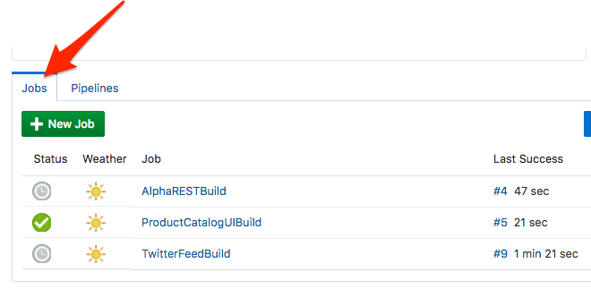 

- You can also click on the **Deploy** tab and monitor the deployment process after the builds have completed.

    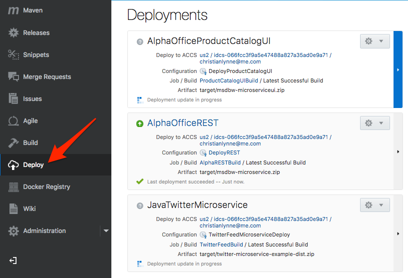 

- **You are now done with this lab.**
