# Oracle Developer Cloud Service Administration

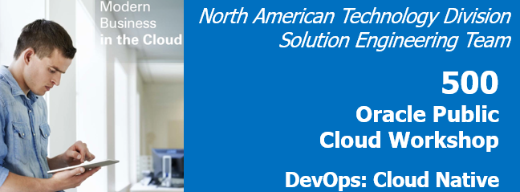  
Update: October 1, 2017

## Introduction

This is the Fifth of several labs that are part of the **Oracle DevOps and Cloud Native Microservices workshop**. This workshop will walk you through the Software Development Lifecycle (SDLC) for a Cloud Native project that will create and use several Microservices.

In this lab, Lisa Jones (The Project Manager) will complete the Sprint and view the Agile reports provided by the Oracle Developer Cloud Service

**To log issues**, click here to go to the [github oracle](https://github.com/oracle/learning-library/issues/new) repository issue submission form.

## Objectives
- Access Developer Cloud Service
- Complete Sprint
- Run Backlog and Sprint Reports
- Review Administrative Tasks

## Required Artifacts
- The following lab requires an Oracle Public Cloud account that will be supplied by your instructor.

# Close the Sprint

## Connect to the Develop Cloud Service

### **STEP 1**: Select the Agile Dashboard

- This Lab assumes that you completed Lab 100, 200, 300, and 400 and are still connected to the Oracle Cloud, that you're still in the Developer cloud Service Dashboard, and you're viewing the ""Alpha Office Product Catalog Project". If for some reason that is not the case, follow the first several Steps of Lab 100 to once again view the Developer Cloud Service Console.

- Although you will remain connected to the Oracle Cloud using the user account you were provided, you are to take on the Persona of ***Lisa Jones*** as you perform the following steps.

      

- Click on **Agile** on the Microservice Board.

    

- Click on the **Reports** Button and explore the **Burndown Chart**.

    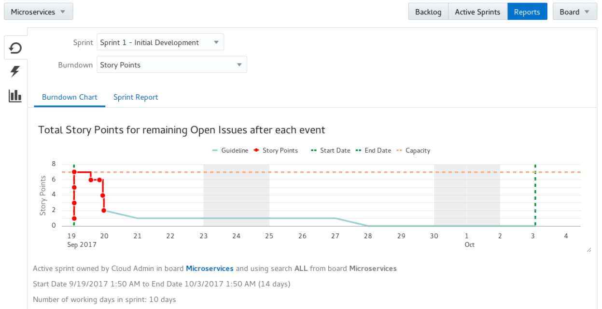

- Click on the **Sprint Report** Tab.

    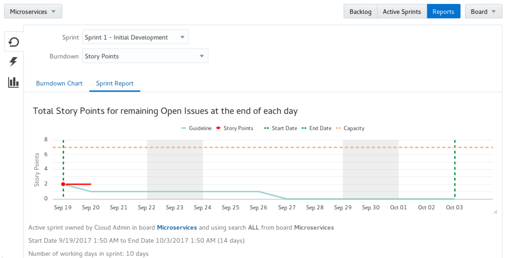

### **STEP 2**: Complete the Sprint

- Click on to the **Active Sprints** button, then click **Complete Sprint**.

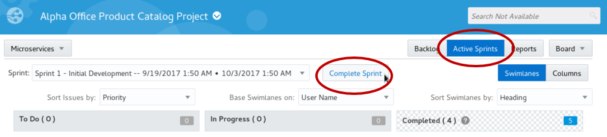

- **Confirm** and **Complete** the Sprint

# Project Administrative Features

## Review Administrative Features

### **STEP 3**: Review Administrative Options

- Click on **Administration** navigation to view the available administrative options. Click on the **Properties icon**.

    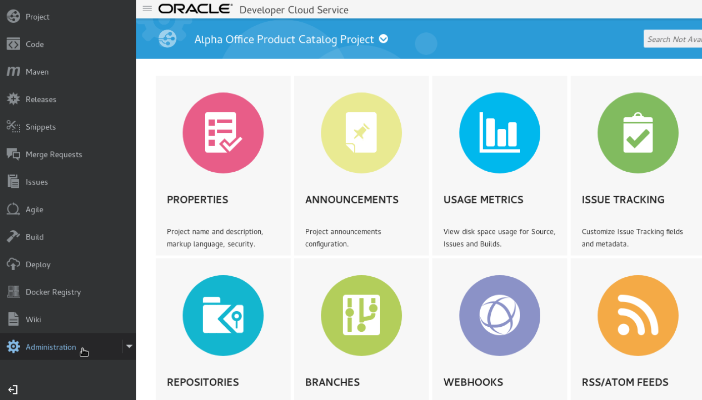

- From this panel you are able to set the default properties for the Project. This is also the where the project can be deleted.

    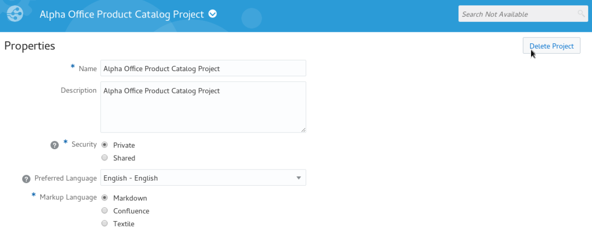

- Click on the **Administration** drop down to view the other Administration options. Select the **Usage Metrics**.

    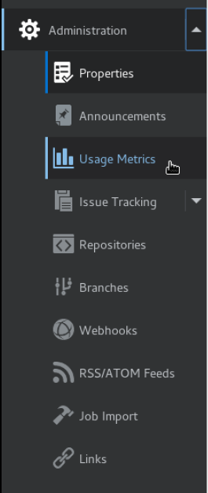

- The Usage Metrics will display the available storage allocation and usage for Git, Maven, Hudson, Tasks and the Wiki.

    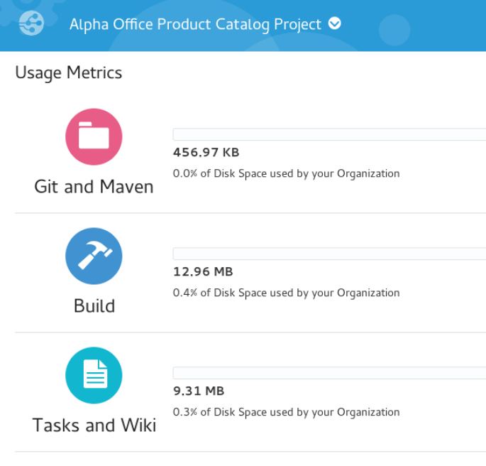

- From the Administration Menu options list select **Issues Tracking** to view the options available for Issue configuration.

    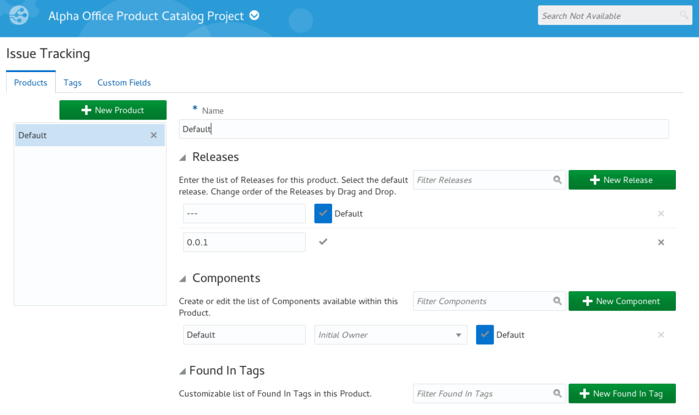

- From the Administration Menu options list, select **Repositories**. From this screen you can manage both Hosted and External Repositories.

    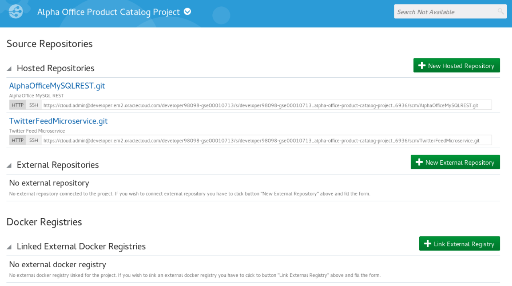

- From the Administration Menu options list, select **Branches** to view the repository branches by User or Branch.

    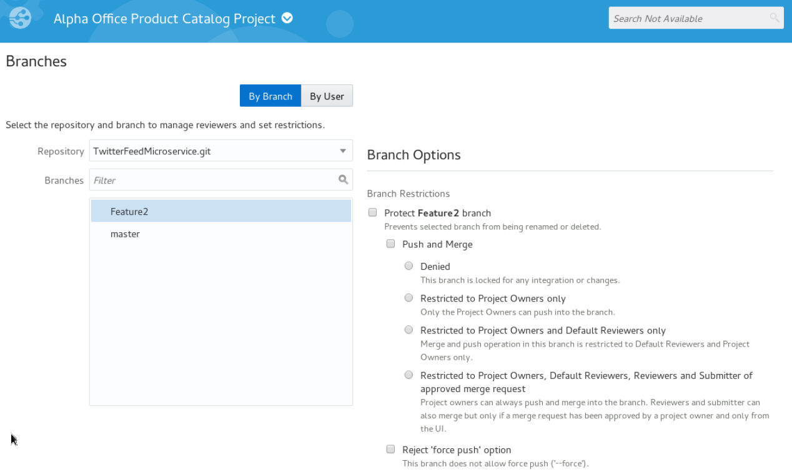

- **You have now completed this lab.**
