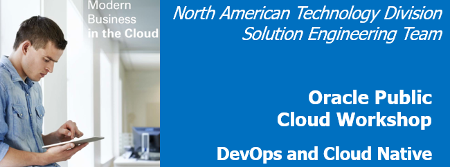
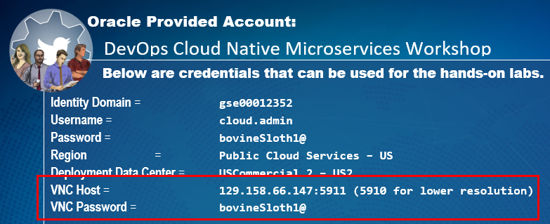
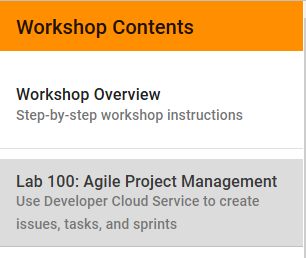

# DevOps and Cloud Native Microservices Workshop Overview 

Update: March 2, 2017

## Overview

This Oracle Public Cloud DevOps and Cloud Native Microservices workshop will walk you through the Software Development Lifecycle (SDLC) for a Cloud Native project, during which you will create and use several Microservices. During this workshop you will take on the role of 4 personae. As the first persona - the Project Manager - you will create the projects, add tasks and features to be worked on, and assign tasks to developers.  The Project Manager will then start the initial sprint. The Java Developer persona will develop a new twitter feed microservice that will allow for retrieval and filtering of twitter data. The Full Stack Developer persona will develop a new database microservice that allows access to the product catalog data. The JavaScript Developer persona will make enhancements to the Product Catalog UI that will display the twitter data related to a select catalog item.  During the workshop, you will get exposure to Oracle Developer Cloud Service and Oracle Application Container Cloud Service.

- All setup steps and lab replays have been posted on [youtube](https://www.youtube.com/playlist?list=PLPIzp-E1msrZhDmRUnNBSYY6LJ2yWh3Ro). You can **watch the videos** to gain an overview of the workshop and what's required to successfully complete the labs.

# Workshop Prerequisites 

## _Login to Hosted Development Environment_

### **Step 1**: Install and VNC into Development Image

To provide the best possible experience during your time at Oracle Code your instructor has created a development environment prior to your arrival. The environment contains all the development software required to perform today's labs. To access the environments please follow the steps below.

- Download [VNC Viewer](https://www.realvnc.com/en/connect/download/viewer/).  

- Double Click on the downloaded file to open VNC Viewer.

- Your Instructor will you with access to a Linux image with all the required development software to complete today's Lab. Please look at the handout provided by your instructor and take not of the VNC host and password fields.

- Enter your VNC Host IP address into the VNC Viewer and press enter.

- Enter your VNC Host password into the VNC Viewer prompt and press enter.

- You receive the unecrypted connection message below, please check the box and press continue.

- You can now begin Lab 100. Please click on the Hamburger icon at the top of the page, then select Lab 100.

