# DevOps and Cloud Native Microservices Workshop Overview 


Update: March 1, 2017

## Overview

This Oracle Public Cloud DevOps and Cloud Native Microservices workshop will walk you through the Software Development Lifecycle (SDLC) for a Cloud Native project, during which you will create and use several Microservices. During this workshop you will take on the role of 4 personae. As the first persona - the Project Manager - you will create the projects, add tasks and features to be worked on, and assign tasks to developers.  The Project Manager will then start the initial sprint. The Java Developer persona will develop a new twitter feed microservice that will allow for retrieval and filtering of twitter data. The Full Stack Developer persona will develop a new database microservice that allows access to the product catalog data. The JavaScript Developer persona will make enhancements to the Product Catalog UI that will display the twitter data related to a select catalog item.  During the workshop, you will get exposure to Oracle Developer Cloud Service and Oracle Application Container Cloud Service.

- All setup steps and lab replays have been posted on [youtube](https://www.youtube.com/playlist?list=PLPIzp-E1msrZhDmRUnNBSYY6LJ2yWh3Ro). You can **watch the videos** to gain an overview of the workshop and what's required to successfully complete the labs.


# Workshop Prerequisites 

## _Acquire an Oracle Cloud Trial Account_

### **Step 1**: Getting your Trial Account

- If you do not have a trail account please click on this URL [cloud.oracle.com/tryit](http://cloud.oracle.com/tryit&intcmp=DeveloperInnovation-HOL-11NOV17), and complete all the required steps to get your free Oracle Cloud Trial Account.
- You will need to wait until you receive the following email before proceeding to the next step. 

_Please note that this email may arrive in your spam or promotions folder pending your email settings._

## _Record Information, Configure Storage and Connect to the Cloud_

### **Step 2**: Record Information from the Welcome Email and Login

- During the provisioning of your account, you will receive two welcome email message. ***Note: You must wait for the 2nd email shown below***, as it contains information about the ***Traditional Account***, which is required for this workshop. If the second email does not appear within 30 minutes, please check your Junk or Promotions email folders (based on your email provider).

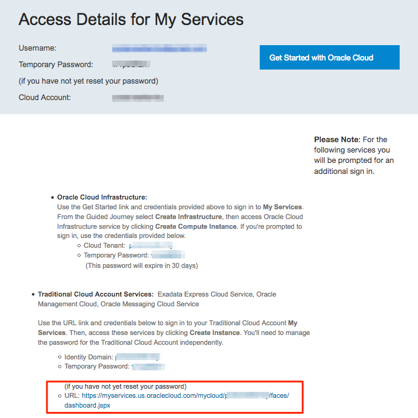

- For later use during the workshop labs, **record the following fields**, some of which you'll find in the email. The other **fields not found in the email** will be located shortly. This information will be ***used multiple times*** during the workshops Labs, so we recommend that you **copy the following list to a text document**, and then populate the fields as they are collected from the **Welcome Email** documented above.

```
Username:
Temporary Password (for Both Accounts):

Cloud Account Name:
Cloud Account Password:

Identity Domain Name:
Traditional Account Password:

Identity Tenant ID:
Data Center:
```

- ***(1)*** **Username**: With a trial account, this should be your email address.
- ***(2)*** **Temporary Password**: The first time you login, you will use this temporary password.
- ***(3)*** **Cloud Account Name**: This name will be used when you login  using the **Cloud Account with Identity Cloud Service**. ***Note***: When you click on Link **(5)** in the email, you will use this Cloud Account Name. This is the method by which all Oracle Services will eventually be authenticated.
- **Cloud Account Password**: You will login to your Cloud Account to set this password.
- ***(4)*** **Identity Domain Name**: This name will be used when you login with the **Traditional Cloud Services**. During this workshop, we will be use the Developer Cloud Services, which is currently a Traditional Cloud Services. ***Note***: When you click on Link **(6)** in the email, you will use this Identity Domain Name.
- **Traditional Account Password**: You will login to your Traditional Cloud Account to set this password in an upcoming step.
- **Identity Tenant ID**: We will locate this information later, but make a holding place in your notes for this field. This field will be used when creating a connection between the Developer Cloud Service (DevCS) and the Application Cloud Service (ACCS), allowing automatic deployment of Applications.
- **Data Center**: We'll locate this information in an upcoming step, and this fields will also be used when creating the connection between DevCS and ACCS.

### **Step 3**: Log into your Cloud Account

- Click on the link ***(5)*** **Cloud Account My Services URL** provided in the email.
- Follow the instructions to **set your password**, and then record in your notes the new password for this **Cloud Account Password** field.

- You are now have viewing the dashboard used to access all the Cloud Services managed by the Oracle Identity Cloud Services.

- Click on the **Customize Dashboard** box to add the some select services to the Dashboard.

    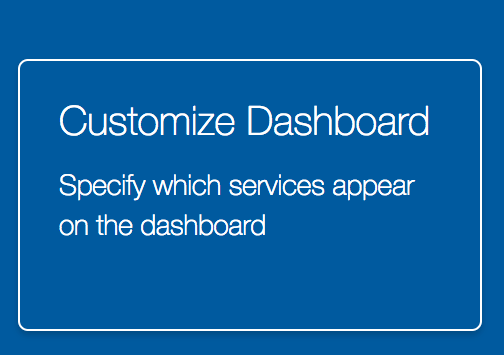

- Located the **Identity Cloud** Services, and click on **Show**.

    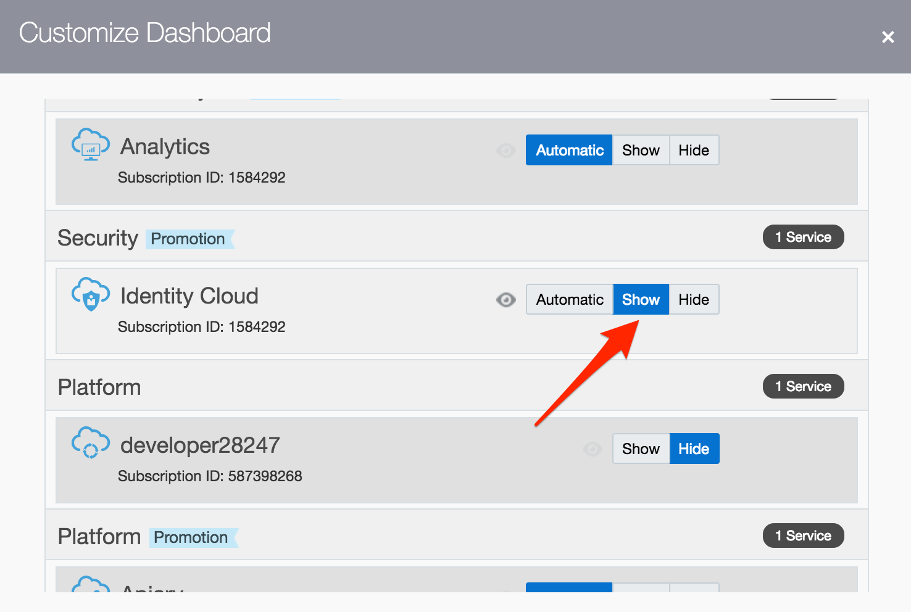

- Also locate and **Show** the **Storage Classic** and **Application Container** cloud services. Exit the Customization popup by clicking on the **X** in the upper right corner of the dialog.

    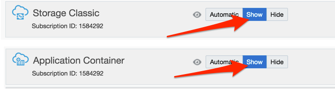

- To capture the **Tenant ID**, click on the **Identity Cloud** service you just added to the Dashboard.

    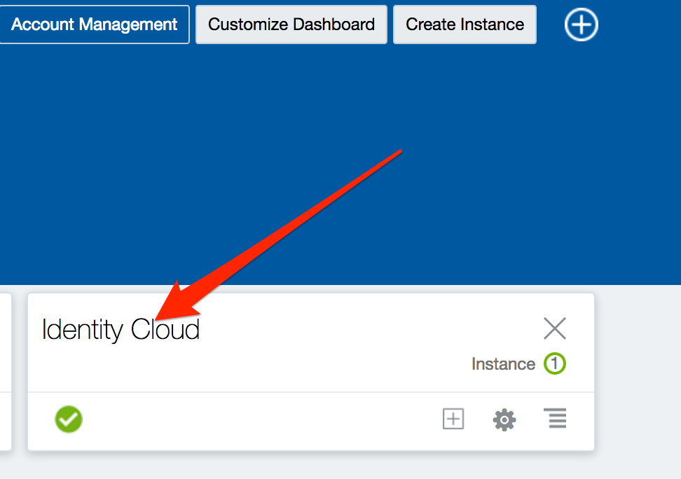

- Once the Console has loaded, The **Tenant ID** is labeled Identity Services ID. Copy and save the text enclosed in the red box. This ID Will be used when connecting to Application Container Cloud Service from the Developer Cloud Services. Copy the ID and save it in your notes.

    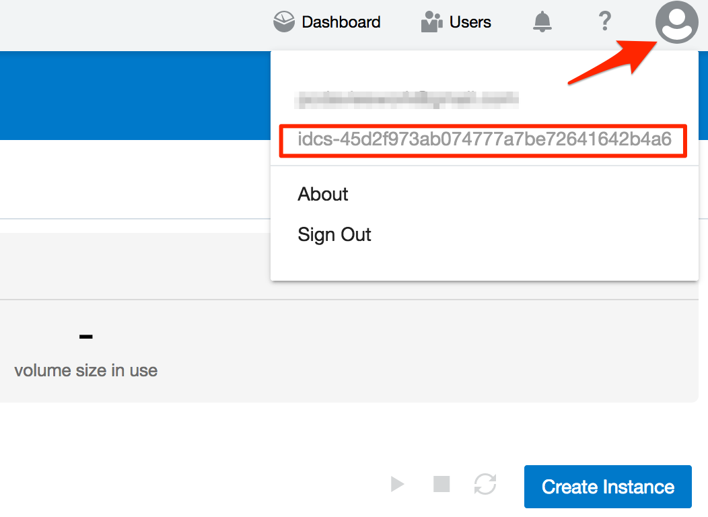

- Return to the main dashboard by clicking on the **Hamburger Menu** and then on the **Dashboard** icon.

    

- From the Dashboard, ***Right Click*** on **Application Container**, and select **Open Link in New Tab**.

    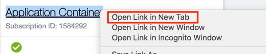

- View the Tab just opened, and save the **Data Region** in your notes. In this example, the data Region is North America. Later on in the workshop you will be asked to select a Data Center for Deployment to the Application Container Cloud Service, and you can use one of the North American Data Centers, e.g. US Commercial 1 or 2. You now have the important user and connection information that will be used during the remainder of this workshop. You can now close this browser tab, and return to the main Dashboard.

    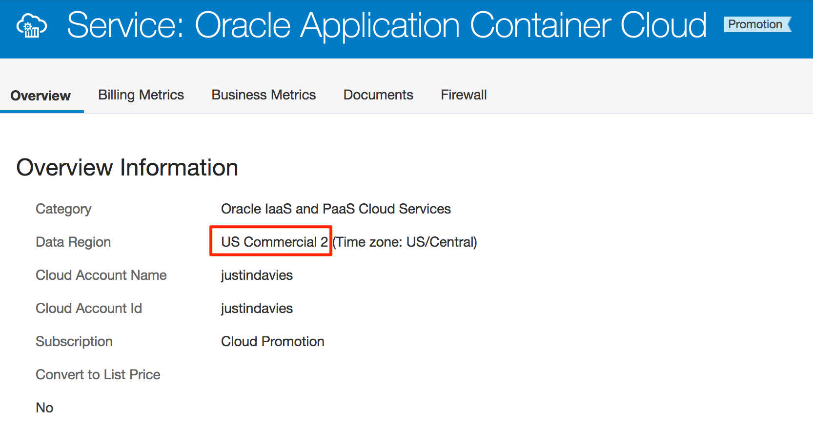

### **Step 4**: Check/Set Storage Replication Policy

Some services that we will use in this workshop require that your account's Replication Policy is set. The following steps will show you how to set your replication policy.

- Click on the **Hamburger Menu** in the upper left corner of the browser window to expose the **Dashboard Menu**, then click on the **Storage Classic** menu option.

    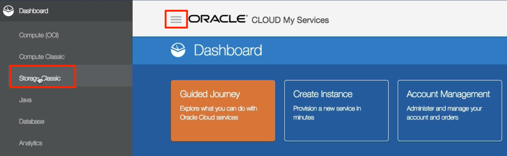

- If your replication policy has not yet been set, the following dialog will be displayed. Use the Default **Georeplication Policy**, and click on **Set Policy**.

    

- To return to the main **Dashboard**, click on the **Hamburger Menu**, and then click on the **My Services** menu option.

    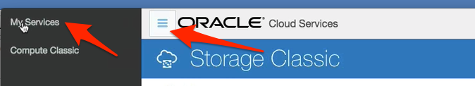

### **Step 5**: Set the Traditional Account Password

We will now set the Password for the **Traditional Account** User. This Account will allow you to access the **Developer Cloud Service**.

- Click on the link **Traditional Cloud Account My Services URL** provided in the Welcome email sent from Oracle.

    

- Follow the instructions to **set your password**, and then record in your notes the new password for  **Traditional Account Password**.

### **Step 6**: Test Logging into your Multiple Accounts

It is important to fully understand how to login to both the **Standard Identity Cloud Service** managed account, and then login to the **Traditional** account at the same time. After this step, we'll assume you know how to switch between accounts and services during the upcoming labs. ***Note: Oracle will soon have all services merged under the Standard Identity Cloud Service Account.*** However, until that time, you need to be aware of your dashboard Account settings, and at times you will need to switch between the Regular Cloud Account and Traditional Cloud Account to view the right services in the Dashboard and Dashboard Menus.

- Fully exit/close your browser to logout and remove all session cookies

- Re-open your browser.

- Go to [cloud.oracle.com](http://cloud.oracle.com)

- Click on **Sign In** at the top of the page.

    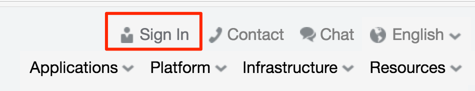

- Set the first field to **Cloud Account with Identity Cloud Service**, enter your **Cloud Account Name** recorded earlier in the second field, and click on **My Services**

    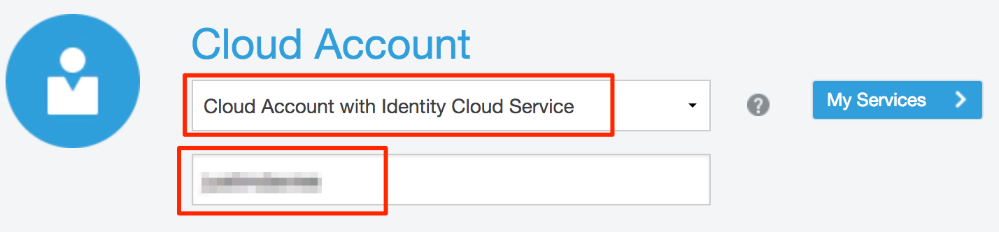

- Enter the **Username** and **Cloud Account Password** recorded earlier, and click on **Sign in**.

    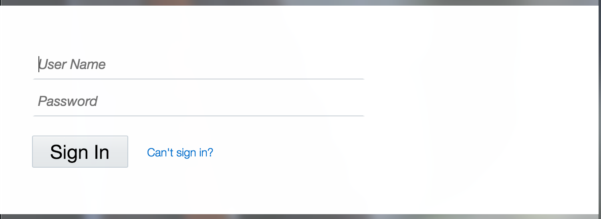

- View the available services after clicking on the Dashboard **Hamburger Menu**.

    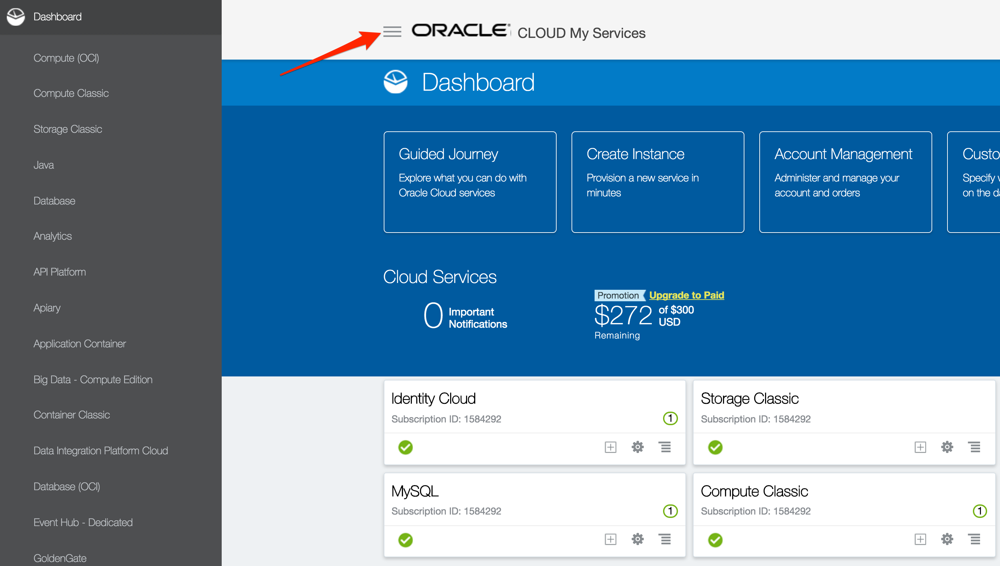

- Let's now connect to the **Traditional Account** at the same time. Open a new Browser tab window, got to [cloud.oracle.com](http://cloud.oracle.com) again, and click on **Sign In**.

    

- Select **Tradition Cloud Account** from the top drop-down. Next select your **Data Center**. In our example, our Data Center was US Commercial 2 - both "US Commercial 2" or "Public Cloud Services - US" work in that example. **Your selection will vary** based on what you recorded earlier in this guide.

- Click on **My Services**

    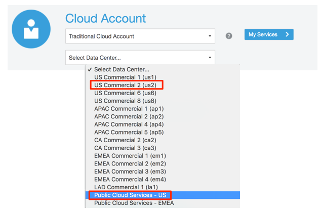

- Enter the **Identity Domain Name** you recorded earlier, and click on **Go**

    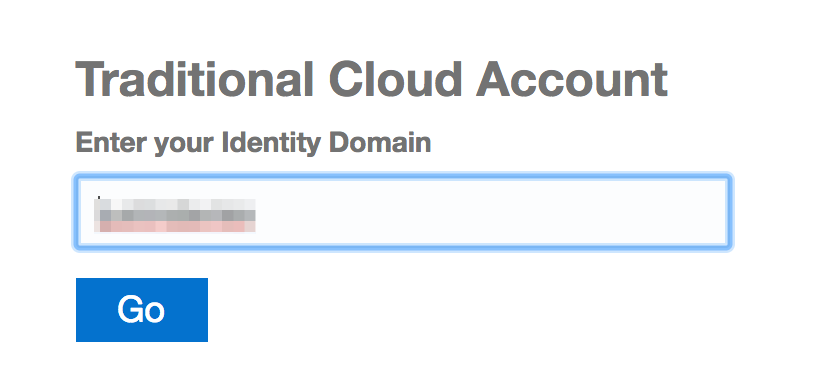

- Enter the **Username** and **Traditional Account Password** you recorded earlier, and click on **Sign In**

    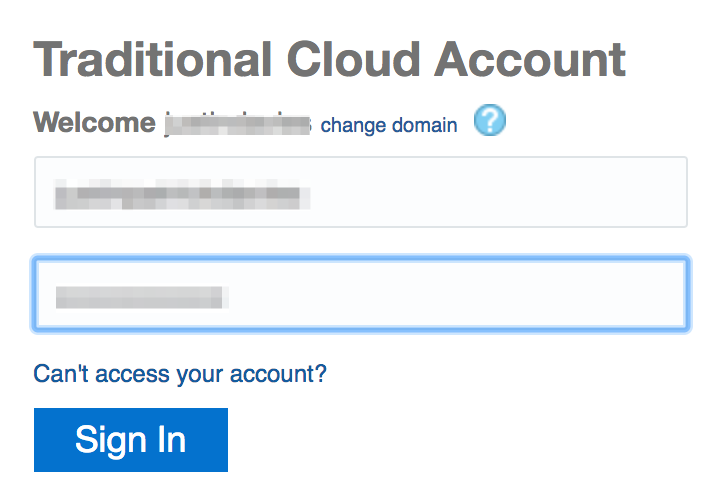

- Click on the Traditional Dashboard **Hamburger Menu**, and view the limited set of available services

    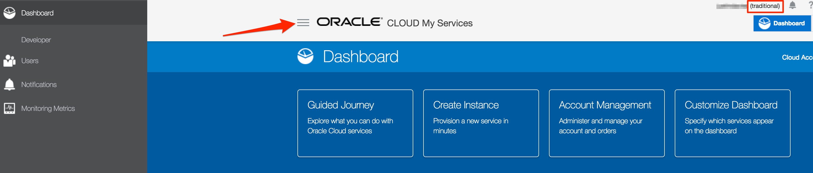

- **Note**: you can change the account on the dashboard page between **Traditional** and the Standard **Identity Cloud Services** accounts, but one approach is to keep a tab/window open for each Account's dashboard.

    

### **Step 6**: Connect into Your Development Environment

To provide the best possible experience during your time at Oracle Code your instructor has created a development environment prior to your arrival. The environment contains all the development software required to perform today's labs. To access the environments please follow the steps below.

- Download [VNC Viewer](https://www.realvnc.com/en/connect/download/viewer/).  


- Double Click on the downloaded file to open VNC Viewer.


- Your Instructor will you with access to a Linux image with all the required development software to complete today's Lab. Please look at the handout provided by your instructor and take not of the VNC host and password fields.


- Enter your VNC Host IP address into the VNC Viewer and press enter.


- Enter your VNC Host password into the VNC Viewer prompt and press enter.


- You receive the unecrypted connection message below, please check the box and press continue.


- You can now begin Lab 100. Please click on the Hamburger icon at the top of the page, then select Lab 100.


