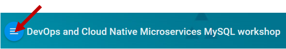
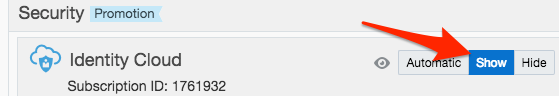
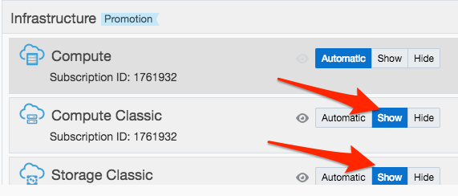
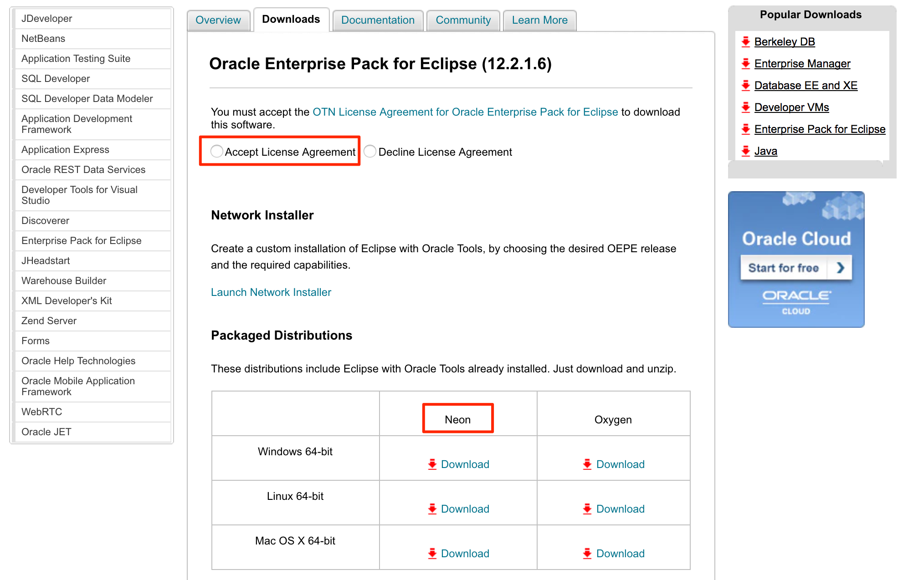
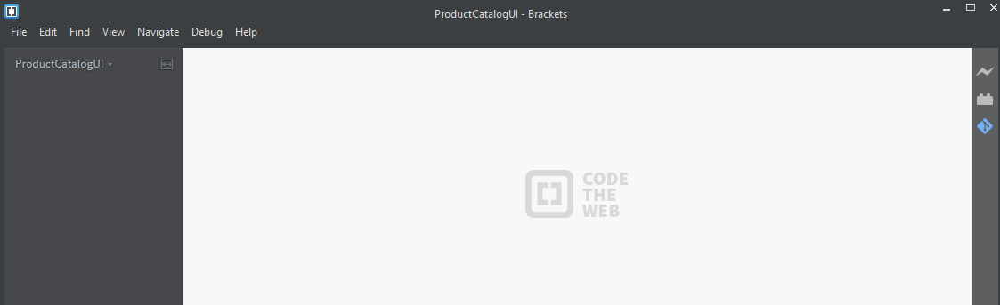
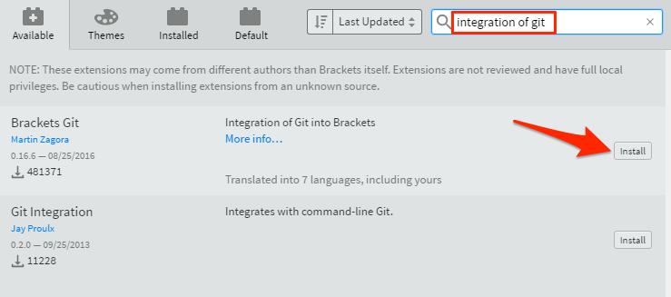
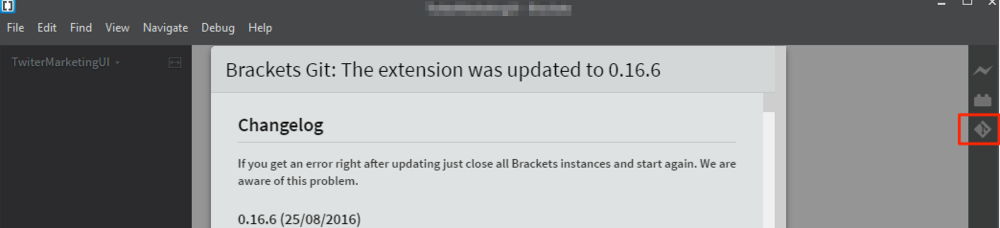

# Trial Account Student Guide


Update: December 7, 2017

## Workshop Introduction

This Oracle Public Cloud DevOps and Cloud Native Microservices workshop will walk you through the Software Development Lifecycle (SDLC) for a Cloud Native project, during which you will create and use several Microservices. During this workshop you will take on the role of 4 personae. As the first persona - the Project Manager - you will create the projects, add tasks and features to be worked on, and assign tasks to developers.  The Project Manager will then start the initial sprint. The Java Developer persona will develop a new twitter feed microservice that will allow for retrieval and filtering of twitter data. The Full Stack Developer persona will develop a new database microservice that allows access to the product catalog data. The JavaScript Developer persona will make enhancements to the Product Catalog UI that will display the twitter data related to a select catalog item.  During the workshop, you will get exposure to Oracle Developer Cloud Service and Oracle Application Container Cloud Service.

- You can see a list of Lab Guides by clicking on the **Menu Icon**

    

- To log issues and view the Lab Guide source, go to the [github oracle](https://github.com/oracle/learning-library/issues/new) repository.

- Visit the [Workshop Interactive Labguide](https://launch.oracle.com/?microservices-devops) for a visual overview of the workshop content.

- All setup steps and lab replays have been posted on [youtube](https://www.youtube.com/playlist?list=PLPIzp-E1msrZhDmRUnNBSYY6LJ2yWh3Ro). You can **watch the videos** to gain an overview of the workshop and what's required to successfully complete the labs.

# Workshop Prerequisites

## _Acquire an Oracle Cloud Trial Account_

### **Step 1**: Getting your Trial Account

- Click on this URL [cloud.oracle.com/tryit](http://cloud.oracle.com/tryit&intcmp=DeveloperInnovation-HOL-11NOV17), and complete all the required steps to get your free Oracle Cloud Trial Account.
- You must wait to receive our account before continuing to the "**Configure Oracle Cloud Identity Information**" Section.

## _Configure Oracle Cloud Identity Information_

### **Step 2**: Record information from the welcome email and login

- During the provisioning of your account, you will receive two welcome email message. ***Note: You must wait for the 2nd email shown below***, as this email signals that your account is fully provisioned. If the second email does not appear within 30 minutes, please check your Junk or Promotions email folders (based on your email provider).


- For later use during the workshop labs, **record the following fields**, some of which you'll find in the email. The other **fields not found in the email** will be located shortly. This information will be ***used multiple times*** during the workshops Labs, so we recommend that you **copy the following list to a text document**, and then populate the fields as they are collected from the **Welcome Email** documented above.

```
Username:
Temporary Password:

Cloud Account Name:
Cloud Account Password:

```

- ***(1)*** **Username**: With a trial account, this should be your email address.
- ***(2)*** **Temporary Password**: The first time you login, you will use this temporary password.
- ***(3)*** **Cloud Account Name**: This name will be used when you login.
- **Cloud Account Password**: Once you reset your temporary password, record your new password.

### **Step 3**: Log into your Cloud Account

- Click on the link ***(4)*** **Get Started with Oracle Cloud** link provided in the email.
- Follow the instructions to **set your password**, and then record in your notes the new password for this **Cloud Account Password** field.

- You are now have viewing the dashboard used to access all the Cloud Services managed by the Oracle Identity Cloud Services.

- Click on the **Customize Dashboard** box to add the some select services to the Dashboard.

    

- Click on **Show** for the **Application Container**, **Developer**, **Identity Cloud**, **Compute Classic** and **Storage Classic** services. Then click the **X** in the top right corner to close the dialog.

    

    

    


### **Step 4**: Check/Set Storage Replication Policy

Some services that we will use in this workshop require that your account's Replication Policy is set. The following steps will show you how to set your replication policy.

- Click on the **Hamburger Menu** in the upper left corner of the browser window to expose the **Dashboard Menu**, then click on the **Storage Classic** menu option.

    

- If your replication policy has not yet been set, the following dialog will be displayed. Use the Default **Georeplication Policy**, and click on **Set Policy**.

    

- To return to the main **Dashboard**, click on the **Hamburger Menu**, and then click on the **My Services** menu option.

    

## _Install Open Source Tools_

## Java JDK

### **Step 5 (Windows Option)**: JDK Verification on Windows

**Note**: Eclipse requires that you have the a Java JDK 8 installed. Even if you have a JRE version 8, you still need to verify that you have a JDK 8 installed.

- On Windows, open a **cmd** window and enter `java -version`

```
C:\Users\usr>java -version
java version "1.8.0_121"
Java(TM) SE Runtime Environment (build 1.8.0_121-b13)
Java HotSpot(TM) Client VM (build 25.121-b13, mixed mode, sharing)
```

- If JDK/**Java version 1.8** is not installed,  you will need to download a [JDK 8](http://www.oracle.com/technetwork/java/javase/downloads/jdk8-downloads-2133151.html) from the Oracle Technology Network website, and install.

### **Step 6 (Mac Option)**: JDK Verification on a MAC

**Note**: Eclipse requires that you have the a Java **JDK** 8 installed. Even if you have a **JRE** version 8, you still need to verify that you have a JDK 8 installed.

- Open Terminal window and execute the following command:

```
ls /Library/java/JavaVirtualMachines/
```

- If you do not have a JDK 1.8 folder, you will need to download the [JDK 8](http://www.oracle.com/technetwork/java/javase/downloads/jdk8-downloads-2133151.html) from the Oracle Technology Network website, and install.

## Eclipse

### **Step 7**: Download Eclipse

***Note***: Even if you already have Eclipse installed, you need to install and use the version documented below. This version of Eclipse contains the ***Oracle Enterprise Pack for Eclipse***, which will be used during the workshop.

- Go to the [Eclipse](http://www.oracle.com/technetwork/developer-tools/eclipse/downloads/index.html) installation website

- Accept the **licensing agreement**, and then select the **Neon** version of Eclipse required for your operating system.

    

- Once you've downloaded eclipse, extract the zip file and install. ***Note:*** If you encounter an error when extracting Eclipse due to a "Path name too long" error on Windows, there are solutions that can be found by performing an internet search on the error to change the Windows allowed file length. Also, we have found that using the open source [7-zip](http://www.7-zip.org/download.html) tool can help overcome the file length errors encountered by the default windows zip file extraction tools.

### **Step 8**: Optionally Configure Proxies (if behind a firewall)

If you are running Eclipse behind a firewall, you need to configure the proxy setting. First, you need to ensure that Eclipse's proxy is set. Next, you need to update the maven proxy setting, and then finally, you need to ensure that the Oracle Plugin will work with your proxy settings.

- To set configure Eclipse's proxy, open Eclipse and navigate to the Properties menu. Depending on the operating system, this drop down is found either from the **Eclipse > Preferences, or Window > Preferences**

    

- From the preferences panel, enter "**proxy**" into the search window, and click on **Network Connections**. Select **Native** for the Active Provider and click on **OK**. This setting works well, but it requires that you have the proxy setting configured correctly on the system running Eclipse – e.g. Windows, MAC OS or Linux. Selecting Manual should also work, but some of the plugins require the underlying operating system's proxy to be configured.

    

- To test that your connection works, select the menu option **Window > Show View > Other**

    

- Type _web_ in the search field, select **Internal Web Browser** and click on **OK**

    

- Enter a **URL** into the browser and press **enter** to test your proxy settings.


### **Step 9**: Optionally Update the Eclipse / Maven proxy (if behind a firewall)

***Note:*** You will only do this optional Eclipse/Maven Proxy setup if you are behind a firewall. Otherwise, skip this step, and go to next step where you will download and install Brackets.

- From the **Eclipse > Preference or Window > Preferences** panel, type **Maven** into the search box.
- Click on the Maven **User Settings**. Make note of the directory where the settings.xml file is to be located. In the example below, the Maven User Settings will be located in the **/home/oracle/.m2** directory

    

- **Cancel** out of the Maven dialog, and **Close** Eclipse

- If the directory does not exist where the settings.xml file is to be located, **create the directory**. In this example, we will create the **.m2** directory.

- Also, create the **settings.xml** file, if it does not exist. Add the following to the settings.xml file (NOTE: you will need to use your correct **Host, Port, nonProxyHosts, username and Password settings**):

```
<?xml version="1.0" encoding="UTF-8"?>
<settings xmlns="http://maven.apache.org/SETTINGS/1.1.0" xmlns:xsi="http://www.w3.org/2001/XMLSchema-instance"
xsi:schemaLocation="http://maven.apache.org/SETTINGS/1.1.0 http://maven.apache.org/xsd/settings-1.1.0.xsd">
<proxies>
<proxy>
<active>true</active>
<protocol>http</protocol>
<username>proxyuser</username>
<password>proxypass</password>
<host>www-proxy.us.oracle.com</host>
<port>80</port>
<nonProxyHosts>local.net|some.host.com</nonProxyHosts>
</proxy>
<proxy>
<active>true</active>
<protocol>https</protocol>
<username>proxyuser</username>
<password>proxypass</password>
<host>www-proxy.us.oracle.com</host>
<port>80</port>
<nonProxyHosts>local.net|some.host.com</nonProxyHosts>
</proxy>
</proxies>
</settings>
```

- Reload Eclipse to use the new maven settings

## Git and Brackets

### **Step 10**: Download/Install Git

- Go to the following URL: https://git-scm.com/downloads

    

- Select your OS. In our example, we will show how to install on Windows. Click **Windows** Download and click **Save File**

    

- Select your download location and click **Save**. We will use D:\Software    

    

- Open Windows Explorer and navigate to where you downloaded the Git executable. Double click on the Git executable to start the install process.

    

- Run through the installation process. In our tests, we used the default installation settings.

    

### **Step 11**: Download/Install the Brackets Text Editor

- Go to the following URL: http://brackets.io    

    

- Click **Download Brackets 1.X** then click **Save File**

    

- Select your download location and click **Save**. We will use D:\Software

    

- Open Windows Explorer and navigate you where you downloaded Brackets. Double click on the Brackets executable to start the install process.


- Run through the installation process. In our tests, we used the default installation settings.

### **Step 12**: Start Brackets and Configure Git

- From a location of your choice, create a directory called **ProductCatalogUI**. From Windows Explorer navigate to the directory **ProductCatalogUI**, right click and select **Open as Brackets Project**

    

- Select **File -> Extension Manager…**

- In the search field, type `integration of git`. Click **Install** for **Brackets Git**

    

- After the install completes, leave the defaults for Git Settings and click **Save**

    

- Click **OK** to restart Brackets

    

- You will now see the Git icon on the right-hand panel

    

- You can now ready to start on [Lab 100](CloudNative100.md) Lab

# Workshop Objectives

## Lab 100: Agile Project Management

**Documentation**: [CloudNative100.md](CloudNative100.md)

### Objectives

- Create Initial Project
- Create Product Issues
- Create Issues for Twitter Feed Microservice
- Create Issues for Database Microservice
- Create Issues for Product Catalog UI enhancements
- Create Agile Board and initial Sprint
- Add Issues to Sprint

## Lab 200: Continuous Delivery of Java Microservices

**Documentation**: [CloudNative200.md](CloudNative200.md)

### Objectives

- Access Developer Cloud Service
- Import Code from external Git Repository
- Import Project into Eclipse
- Build and Deploy project using Developer Cloud Service and Oracle Application Container Cloud Service

## Lab 300: Continuous Delivery of Database Microservices

**Documentation**: [CloudNativeMy300.md](CloudNative300.md)

### Objectives

- Access Developer Cloud Service
- Import Code from external Git Repository
- Build and Deploy project using Developer Cloud Service and Oracle Application Container Cloud Service

## Lab 400: Cloud Native Rapid JavaScript Development with node.js

**Documentation**: [CloudNative400.md](CloudNative400.md)

### Objectives

- Access Developer Cloud Service
- Import Code from external Git Repository
- Import Project into Brackets
- Build and Deploy project using Developer Cloud Service and Oracle Application Container Cloud Service

## Lab 500:  Oracle Developer Cloud Service Administration

**Documentation**: [CloudNative500.md](CloudNative500.md)

### Objectives

- Access Developer Cloud Service
- Complete Sprint
- Run Backlog and Sprint Reports
- Review Administrative Tasks
